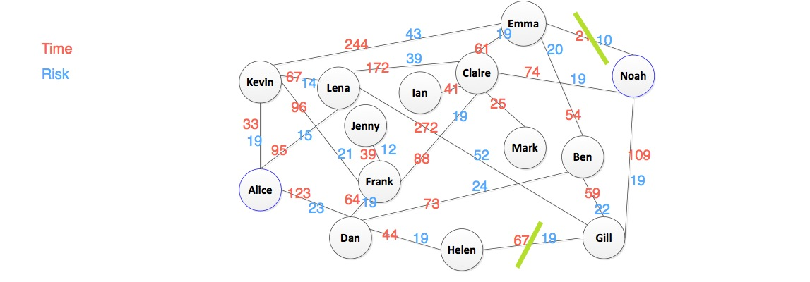

Artificial Intelligence
=======================

#### CSCI 561: Foundations of Artificial Intelligence
###### Instructor: Prof. Laurent Itti
###### Homework #1: Uniformed Search
###### Due on February 13 at 11:59pm, Los Angeles time, 2013

#### Description
In this assignment, we will re-examine the small-world experiment in social network using uniformed search algorithms. For those who are not familiar with the experiment, please refer to [1][2]. To give you a realistic and modern context, we twist the experiment and put it into a limited scope of a simplified social network. Suppose Alice is a graduate student in computer science at USC, and she wants to start her own IT company by applying a great idea. She has to look for investment from industry. Noah catches her eye as a CEO of a notable venture capital company. Alice plans to send Noah a message and give her an outline of the startup plan. To make herself reliable, Alice thinks it's good to send the message via Facebook to someone Noah trusts and who is also her friend in an effort to convey the message. Thanks to Facebook, Alice is able to see the friends Noah has. Unfortunately, Alice cannot find any mutual friends she has with Noah. However, with the help of one of her friends, who is an expert in social network mining, she manages to find the relevant people who might be able to forward her message. The following figure depicts the social network, where links between two nodes represent "friend" relationship between the two people. There are three factors she should consider while sending her message:

1. To transmit the message as efficiently as possible, Alice will use a postscript in her message to tell anyone who receives the message that she/he should only forward it to her/his friend(s). This means the message is forwarded along the "friendship" links in the social network. Otherwise, Alice could be at risk of failure in delivering the message since one would not forward the message if she/he receives from someone unknown to her/him.
2. The delivery time is one of Alice’s concerns. Her expert friend helped estimate the reaction time it takes for one to receive a message from another person and forward the message. It was done by mining the social interactions in Facebook. To deliver the message as soon as possible, Alice should choose a traversal path that is optimal.
3. As you know, online social networks such as Facebook are not quite reliable in terms of privacy protection. While sending the message, there is a certain chance that the message gets disclosed and becomes "public". This is definitely not what Alice wants. Her expert friend also calculated a risk value for the message getting disclosed when it is sent between two people. A higher risk value indicates a greater risk.

You will need to write a program to implement the following search algorithms, to help Alice find optimal traversal path(s) to send her message to reach Noah.

* Breadth-first search
* Depth-first search
* Uniform-cost search
	- Using time as cost
	- Using risk as cost

#### Input
You are provided with a file social-network.txt based on Figure 1. Each line describes the reaction time for the recipient to forward the message, and the risk of disclosing the message as well. A sample line would be:

Lena Claire 17 39

This represents that it takes 17 hours for Claire to react and forward the message if Lena send the message to Claire. The risk of disclosing the message is 39 while sending the message between them. Please note that you may assume the friendship is mutual, so it also takes equal amount of time to send the message from Claire to Lena. It also applies to the risk value.

#### Output
The program should output the nodes (separated by "-") in the order that show the path of forwarding the message. For example, Alice-Dan-Ben-Emma-Noah.
There should be four .txt output files for all algorithms (one for each algorithm).

* breadth-first.result.txt
* depth-first.result.txt
* uniform-cost.time.result.txt 4. uniform-cost.risk.result.txt

#### Suggestion
To make sure your program outputs the right results. You may compute each result manually and compare it with that of your program.

#### References
* [1]. http://en.wikipedia.org/wiki/Small-world_experiment
* [2]. http://www.cs.cornell.edu/home/kleinber/swn.d/swn.html

#### Readme
I implemented this homework by using C++. I write the Makefile and it include all the compile command, you can just type "make" to compile all the code and get the executable file. The executable file should be "csci561_hw1", and type "./csci561_hw1" will execute my program and write the result into txt files.

By default, the program read the "social-network.txt" and search from "Alice" to "Noah". You can input your arguments to satisfy your requirements. This program can only read two or three arguments, for example,

	./csci561_hw1 Kevin Gill			// the program will read "social-network.txt" and search from "Kevin" to "Gill"
	./csci561_hw1 Kevin Gill XXX.txt	// the program will read "XXX.txt" and search from "Kevin" to "Gill"

the program will turn to default situation if there is no argument or more than three arguments. In addition, if the arguments make no sence, the program will output nothing.