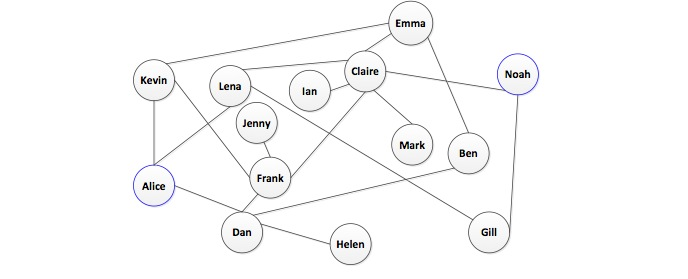

Artificial Intelligence
=======================

#### CSCI 561: Foundations of Artificial Intelligence
###### Instructor: Prof. Laurent Itti
###### Homework #2: Greedy and A* Search
###### Due on March 11 at 11:59pm, Los Angeles time, 2013

#### Description
In this assignment, you will continue with the same message delivery problem in social network. You are asked to implement Greedy and A* searches to help Alice choose a path to successfully send the message to Noah in an efficient way.

Recently, Alice has tried selecting several paths to send the message. But unfortunately, they all failed to reach Noah. By carefully examining the social contacts of each person, Alice found there have been some changes. Some peoples are not friends any more. It happens when there has been conflict of interest between two people, or simply the relationship between them has changed. The following figure shows the updated social network:

The expert friend of Alice suggested applying a heuristic to send the message to reach Noah. By assuming each person may have her/his own channel to reach Noah, he mined the social network and computed the time it might cost for each person to reach Noah directly, and the accompanying risk of disclosing the message as well. We refer to those two values as direct time and direct risk.

You will need to write a program to implement the following search algorithms, to help Alice find optimal traversal path(s) to send her message to reach Noah.

1. Greedy search
	* Using direct time as the heuristic
	* Using direct risk as the heuristic
2. A* search
	* Using time as cost (same as HW1) and direct time as the heuristic
	* Using risk as cost (same as HW1) and direct risk as the heuristic

#### Input
1. You are provided with a file social-network-updated.txt (which is an updated version of social network based on that of HW1). Each line describes the reaction time for the recipient to forward the message, and the risk of disclosing the message as well. A sample line would be:

	Lena Claire 17 39.

	This represents that it takes 17 hours for Claire to react and forward the message if Lena send the message to Claire. The risk of disclosing the message is 39 while sending the message between them. Please note that you may assume the friendship is mutual, so it also takes equal amount of time to send the message from Claire to Lena. It also applies to the risk value.

2. You are also provided with direct-time-risk.txt, which describes the time it may cost for each person to reach Noah directly and the accompanying risk of disclosing the message. A sample line would be:

	Kevin 258 52

	This represents that it might take 258 hours for Kevin to reach Noah directly, and the accompany risk of disclosing the message is 52.

#### Output
The program should output the nodes (separated by "-") in the order that show the path of forwarding the message. For example, Alice-Lena-Claire-Noah.

There should be four .txt output files for all algorithms (one for each algorithm).

* Greedy.time.result.txt
* Geedy.risk.result.txt
* A-star.time.result.txt
* A-star.risk.result.txt

#### Suggestion
To make sure your program outputs the right results. You may compute each result manually and compare it with that of your program.
