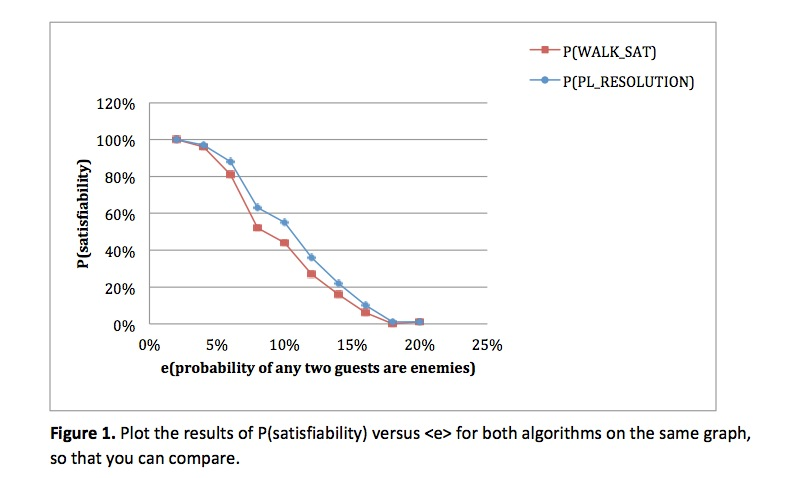
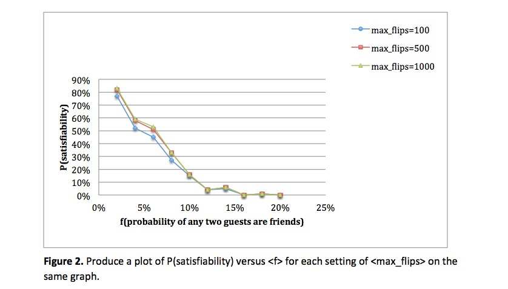
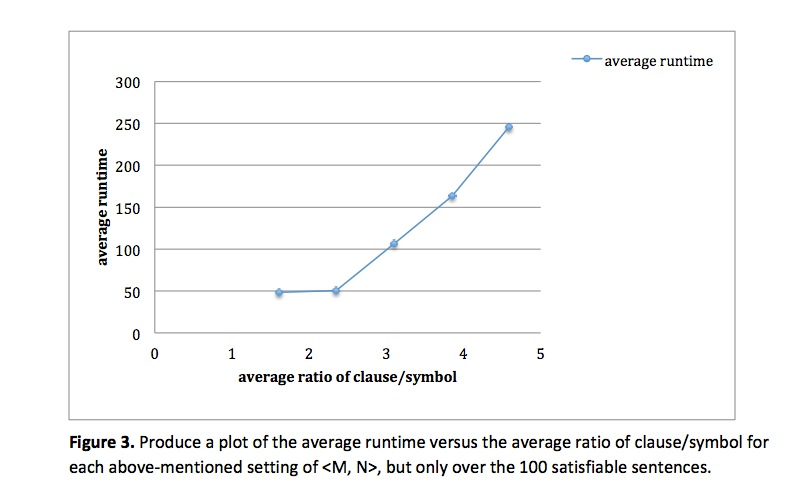

Artificial Intelligence
=======================

#### CSCI 561: Foundations of Artificial Intelligence
###### Instructor: Prof. Laurent Itti
###### Homework #3: Logic and SAT Problem
###### Due on April 10 at 11:59pm, Los Angeles time, 2013

#### Description
Suppose you have a wedding to plan, and want to arrange the wedding seating for a certain number of guests in a hall. The hall has a certain number tables for seating. Some pairs of guests are couples or close Friends (F), and want to sit together at the same table. Some other pairs of guests are Enemies (E), and must be separated into different tables. The rest pairs are Indifferent (I) with each other, and do not mind sitting together or not. However, each pair of guests can only have one relationship, (F), (E) or (I). You need to find a seating arrangement that satisfies all the constraints.

#### Task 1: Logic and SAT Encoding
Suppose there are &lt;M&gt; guests in total, and there are &lt;N&gt; tables in the hall. The number of pairs of Friends is &lt;F&gt;, and the number of pairs of Enemies is &lt;E&gt;. Given relationships of the wedding guests, here we use a matrix R with elements Rij = 1, -1 or 0 to represent whether guest i and j are Friends (F), Enemies (E) or Indifferent (I), the table arrangement task can be represented as First-order Logic (FOL) and further encoded as a Boolean Satisfaction problem (SAT). We introduce Boolean variables Xmn to represent whether each guest m will be seated at a specific table n. You are asked to write FOL to represent the constraints using variables Xmn. Then you need to construct clauses and transform the FOL into CNF sentence. To decompose the arrangement task, there are three constraints you have to satisfy:

1. Each guest i should be seated at one and only one table.
2. Any two guests i and j who are Friends (F) should be seated at the same table.
3. Any two guests i and j who are Enemies (E) should be seated at different tables.

Note that, for simplicity, you do NOT need to consider the capacity constraint of a table. This means the size of each table is assumed to be large enough to seat all the guests.

##### Question 1:
##### Express each of the above-mentioned constraints in FOL and transform into clauses in CNF format.

Xij means guest i seat at table j.

* (a)Each guest i should be seated at one and only one table.

	It is actually a combination of following two constraints:

	FOL: ¬𝑿𝒊𝟏∧¬𝑿𝒊𝟐......∧¬𝑿𝒊 𝒏−𝟏 ∧¬𝑿𝒊 𝒏+𝟏 ......∧¬𝑿𝒊𝑵 ⟹𝑿𝒊𝒏 (1≤i≤M,1≤n≤N)

	CNF: 𝑿𝒊𝟏∨𝑿𝒊𝟐 ...∨𝑿𝒊𝒏...∨𝑿𝒊𝑵 (1≤i≤M,1≤n≤N)

	- (1) Each guest i should be seated at least one table.

	- (2) Each guest i should be seated at most one table.

	FOL: 𝑿𝒊𝒌 ⟹¬𝑿𝒊𝒏 (1≤i≤M,1≤k≠n≤N)

	CNF: ¬𝑿𝒊𝒌∨¬𝑿𝒊𝒏 (1≤i≤M,1≤k≠n≤N)

* (b) Any two guests i and j who are Friends (F) should be seated at the same table.
	
	FOL: 𝑿𝒊𝒏 ⟺𝑿𝒋𝒏 (1≤i,j≤M,1≤n≤N)

	CNF: (¬𝑿𝒊𝒏∨𝑿𝒋𝒏)∧ (¬𝑿𝒋𝒏∨𝑿𝒊𝒏) (1≤i,j≤M,1≤n≤N)

* (c) Any two guests i and j who are Enemies (E) should be seated at different tables.

	FOL: 𝑿𝒊𝒏 ⟹¬𝑿𝒋𝒏∧𝑿𝒋𝒏 ⟹¬𝑿𝒊𝒏 (1≤i,j≤M,1≤n≤N)

	CNF: (¬𝑿𝒊𝒏∨¬𝑿𝒋𝒏) (1≤i,j≤M,1≤n≤N)

	CNF: (𝑿𝒊𝟏 ∨𝑿𝒊𝟐 ...∨𝑿𝒊𝒏... ∨𝑿𝒊𝑵)∧(¬𝑿𝒊𝒌 ∨¬𝑿𝒊𝒏)∧(¬𝑿𝒊𝒏 ∨𝑿𝒋𝒏)∧(¬𝑿𝒊𝒏 ∨𝑿𝒋𝒏)∧(¬𝑿𝒊𝒏 ∨ ¬𝑿𝒋𝒏) (1 ≤ i ≤ M, 1 ≤ k ≠ n ≤ N)

##### How many clauses in total are there to encode a wedding seating arrangement in terms of &lt;M&gt;, &lt;N&gt;, &lt;E&gt; and &lt;F&gt;?
* For (a), &lt;M&gt; + &lt;M&gt; * &lt;N&gt; * (&lt;N&gt; - 1) / 2
* For (b), &lt;F&gt; * &lt;N&gt; * 2
* For (c), &lt;E&gt; * &lt;N&gt;
* Total: (a)+(b)+(c) = &lt;M&gt; + &lt;M&gt; * &lt;N&gt; * (&lt;N&gt; - 1) / 2 + &lt;F&gt; * &lt;N&gt; * 2 + &lt;E&gt; * &lt;N&gt;

#### Task 2: Instance Generator
As the first part of this programming assignment, you will need to write a program to generate CNF sentences for random instances of wedding seating arrangements. Key parameters of the program should include the number of guests &lt;M&gt;, and the number of tables &lt;N&gt;. Moreover, you need to randomly assign each pair of guests as Friends (F), Enemies (E) or Indifferent (I). Suppose any two guests are Friends with probability &lt;f&gt;, or are Enemies with probability &lt;e&gt;. And any two guests are Indifferent to each other with probability &lt;1-f-e&gt;.
Given these parameters &lt;M, N, f, e&gt;, the generator should firstly produce a relationship for each pair of guests. The internal output of the program should be a M by M matrix R with elements Rij = 1, -1 or 0 to represent whether guest i and j are Friends (F), Enemies (E) or Indifferent (I).

Then your program should convert any generated instance of wedding seating arrangement into a CNF sentence. You are free to use whatever internal representation of CNF sentences. You will NOT be asked to input or output sentences for the user for this assignment. In general, it is a good idea to use the most efficient representation possible, given the NP-complete nature of SAT. For instance, in C++, you can represent a CNF sentence as a vector of clauses, and represent each clause as a vector of literals.

#### Task 3: SAT Solvers
You need to implement SAT solvers to find a satisfying assignment for any given CNF sentences. Firstly, you need to implement a modified version of the PL-Resolution algorithm (AIMA Figure 7.12). Modifications are necessary because we are using the algorithm for a slightly different purpose than is explained in AIMA. Here, we are not looking to prove entailment of a particular query. Rather, we hope to prove satisfiability. Thus, there is no need to add negated query clauses to the input clauses. In other words, the only input to the algorithm is the set of clauses that comprise a randomly generated sentence. As an additional consequence of our purpose, the outputs will be reversed compared to the outputs listed in AIMA’s pseudo code. That is to say, if the empty clause is derived at any point from the clauses of the input sentence, then the sentence is unsatisfiable. In this case, the function should return false and not true as the book specifies for this situation. In the opposite situation where the empty clause is never derived, the algorithm should return true, indicating that the sentence is satisfiable.

You are also asked to implement the WalkSAT algorithm (AIMA Figure 7.18). There are many variants of this algorithm exist, but yours should be identical to the algorithm described in AIMA. There are two open parameters associated with WalkSAT: &lt;p&gt; and &lt;max_flips&gt;.
PL-Resolution is a sound and complete algorithm that can be used to determine satisfiability and unsatisfiability with certainty. On the other hand, WalkSAT can determine satisfiability (if it finds a model), but it cannot asbolutely determine unsatisfiability.

#### Task 4: Experiment 1
The difficulty of wedding seat arrangement problem mostly results from dealing with the pairs of Enemies (E) among guests. Use both algorithms to produce a plot of P(satisfiability) (See Figure 7.19(a), AIMA) as a function of the probability &lt;e&gt; with which any two guests are Enemies (E).

Suppose we have a small wedding to plan, and set &lt;M=16, N=2&gt;. In order to eliminate the influence of Friends (F) relationship, we set &lt;f=0&gt;. Generate a set of 100 random sentences for each setting of &lt;e&gt; which increases from 2% to 20% at an interval of 2%, and use both of your algorithms to determine whether they are satisfiable. For WalkSAT, we set &lt;p=50%&gt; and &lt;max_flips=100&gt;. Plot the results of P(satisfiability) versus &lt;e&gt; for both algorithms on the same graph, so that you can compare.

##### Question 2:
##### Compare the curves that result from running this experiment with both algorithms. Are they the same? Why, or why not?

They are not same; PL-Resolution is a sound and complete algorithm that can be used to determine satisfiability and unsatisfiability with certainty. However, WalkSAT can determine satisfiability (if it finds a model), but it cannot guarantee to find a model even there exists one, after max_flips iterations, WalkSAT will terminate no matter whether it find a model. According to Figure 1, the P(satisfiability) of PL-Resolution is always higher than or equal to WalkSAT’s, which support the different ideal of PL-Resolution and WalkSAT.

#### Task 5: Experiment 2
You may have discovered that determining satisfiability with PL-Resolution can be frustratingly slow! This was part of the motivation behind developing local search algorithms like WalkSAT. For easy SAT problems, it can be very easy to find a model using a random walk through the possibilities. Using the relative speed afforded by WalkSAT, we can run experiments that might otherwise be impractical.

Suppose you want to know the effect of the probability &lt;f&gt; with which any two guests are Friends (F) on P(satisfiability). We set &lt;M=16, N=2&gt; as in Experiment 1 and fix &lt;e=5%&gt;. Using only the WalkSAT algorithm with parameter setting &lt;p = 50%, max_flips=100&gt;, run 100 random instances using different settings for &lt;f&gt;: 2% through 20% at an interval of 2%. You also need to vary &lt;max_flips&gt; and compare the results. Increasing &lt;max_flips&gt; to 500 and 1000, run WalkSAT again respectively using the same random instances as we set &lt;max_flips=100&gt;. Produce a plot of P(satisfiability) versus &lt;f&gt; for each setting of &lt;max_flips&gt; on the same graph.

##### Question 3:
##### What seems to happen to the satisfiability as &lt;f&gt; increases? Give an explanation as to why this might be the case.

From Figure 2, we can see with the &lt;f&gt; increases, P(satisfiability) decreases very quickly and tends to 0% after &lt;f&gt; increases to 16%. Because in this experiment, we set the fix &lt;M=16, N=2&gt; and &lt;e=5%&gt;, when &lt;f&gt; increase, the problem become more restrict and hard. Therefore, WalkSAT is harder to find a model with the &lt;f&gt; increase.

##### Question 4:
##### How does the result vary with different &lt;max_flips&gt;? Why, or why not?
As can be seen, when the max_flips is higher, P(satisfiability) may higher. Because, with higher max_flips, WalkSAT can perform more iteration when searching, is more likely to find a model. However, when &lt;f&gt; increase, there are not much different among these three max_flips setting, because the problem become harder or even don’t exist a model.

#### Task 6: Experiment 3
The difficulty of the wedding seat arrangement also depends on how large the wedding is (how many guests and how many tables). We now restrict our analysis to only satisfiable sentences with different settings of &lt;M, N&gt;. We only record runtimes for sentences for which a model is found before WalkSAT reaches max_flips iterations. Any sentences for which no model is found in max_flips iterations should be deemed unsatisfiable and eliminated from the results.

We set &lt;f=2%, e=2%&gt; throughout this experiment, and increase the size of the wedding by sequentially setting &lt;M, N&gt; as &lt;16, 2&gt;, &lt;24, 3&gt;, &lt;32, 4&gt;, &lt;40, 5&gt; and &lt;48, 6&gt;.
Fixing &lt;p=50%, max_flips=1000&gt;, run only the WalkSAT algorithm for random instances until 100 satisfiable CNF sentences are generated for each setting of &lt;M, N&gt;. You are asked to record the runtime it takes at average to determine their satisfiability status. Runtime is measured by counting the number of iterations through the WalkSAT algorithm (i.e., following in AIMA Figure 7.18, what is the iterator i when finished?). Record the ratio of the number of clauses to the number of symbols for each satisfiable sentence as well.

Produce a plot of the average runtime versus the average ratio of clause/symbol for each above-mentioned setting of &lt;M, N&gt;, but only over the 100 satisfiable sentences.

##### Question 5:
##### Is the average ratio of clause/symbol in the sentences consistent with that you theoretically derive from the result of Question 1? Why or why not? You need to consider the probability setting &lt;f=2%, e=2%&gt; in this case.

Yes, first point refer to setting &lt;M=16, N=2&gt;, and &lt;f=2%, e=2%&gt;:

* &lt;F&gt; = (&lt;M&gt; + 1) * &lt;M&gt; / 2 * f = 2.72,
* &lt;E&gt; = (&lt;M&gt; + 1) * &lt;M&gt; / 2 * e = 2.72,

Number of clauses equals to:

* &lt;C&gt;=&lt;M&gt;+&lt;M&gt;*&lt;N&gt;*(&lt;N&gt;-1)/2+&lt;F&gt;*&lt;N&gt;*2+&lt;E&gt;*&lt;N&gt;=16+16*2*1/2+2.7*2*2+2.7*2=48.3,

Number of symbols equals to:

* &lt;S&gt; = &lt;M&gt; * &lt;N&gt; = 16 * 2 = 32,

Ratio of clause/symbol:

* &lt;R&gt; = &lt;C&gt; / &lt;S&gt; = 48.2 / 32 = 1.51, which is close to the value in the Figure 3.

Similarly, for the other setting, we can calculate in the same way.

* For &lt;M=24, N=3&gt;, &lt;R&gt; = 2.1,
* For &lt;M=32, N=4&gt;, &lt;R&gt; = 2.74,
* For &lt;M=40, N=5&gt;, &lt;R&gt; = 3.64
* For &lt;M=48, N=6&gt;, &lt;R&gt; = 4.14

These might a little less than the value in Figure 3, the reason may be the deviation of generates the pairs of Friends and Enemies; computer may generate the higher pairs than we expect, but the trend is similarly.

##### Question 6:
##### How does average runtime change with regard to the average ratio of clause/symbol in this experiment? Is the curve consistent with that of AIMA Figure 7.19(b)? Why or why not?
As can be seen from Figure 3, this curve is not consistent with that of AIMA Figure 7.19(b), because in AIMA Figure 7.19(b), it is based on the same symbol, 50-symbol problems. And here, we not only increase the number of clauses, but also the number of symbols. In Figure 3, shows that the problem is easy at first, about 50 runtime can solve it. But it becomes harder and harder as the ration increases.

#### Readme
I implemented this homework by using C++. I write the Makefile and it include all the compile command, you can just type "make" to compile all the code and get the executable file. If you cannot complile my code by "g++ *.cpp -o hw3", please try Makefile.

The command should be -exp1, -exp2 and -exp3.
In addition, you can just try command -debug to see the process. The setting of debug is in the "for debug" area in .h file.