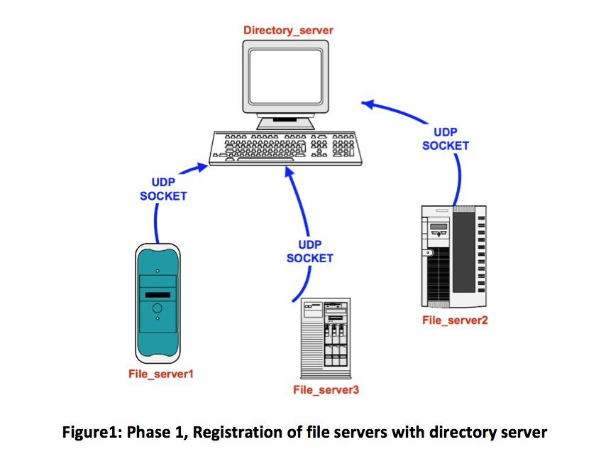
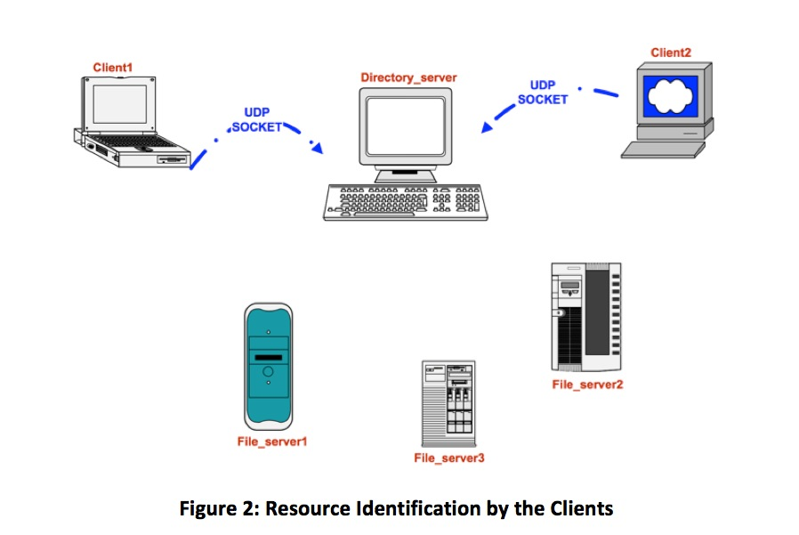
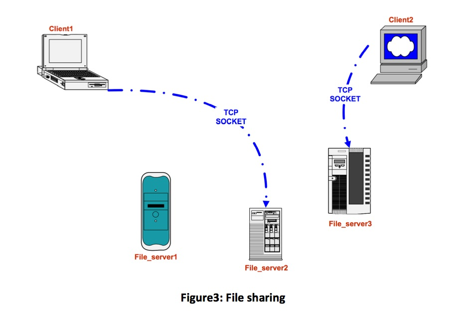
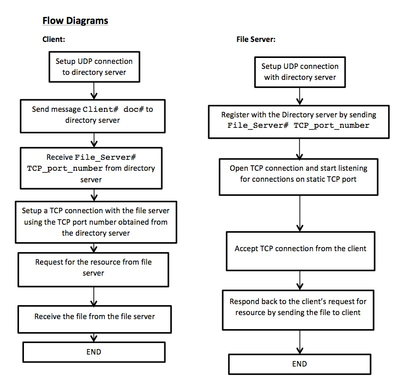
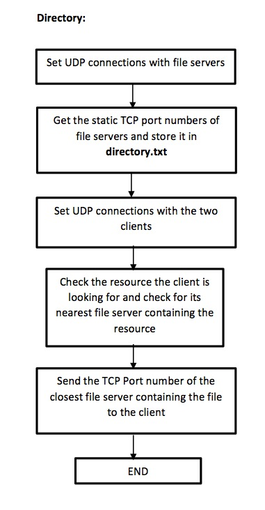

Computer Network
================

#### EE450 Socket Programming Project, Fall 2013
###### Due Date: Sunday November 24th, 2013 11:59 AM (Noon)

#### Problem Statement
In this project you will be simulating a resource-discovery / file-sharing network using a hybrid architecture with TCP and UDP sockets. The project has three major phases: 1) registration, 2) resource discovery, and 3) file-sharing. In phases 1 and 2, all communications are through UDP sockets. In phase 3 however, all the communications are over TCP connections i.e. through TCP sockets. The main components of this network architecture are: 1) three file servers, who have the files to be served to the clients, 2) one directory server, who operates as a coordinator between the clients and the file servers, and 3) two clients who contact the directory server to ask where (i.e. in which file server) to find the file they want to get.

#### Input Files Used
The files specified below will be used as inputs in your programs in order to configure the state of the network.

1. topology.txt: This input file contains information about the cost of accessing each file server from each client (i.e. the network topology). Since there are 2 clients and 3 file servers, topology.txt has only 2 lines and each line contains the costs (i.e. a positive integer) to reach each file server from a client, separated by a single space. For instance, an example of the contents of the topology file can be:

		2 45 87
		11 3 27

This means that client 1 can reach file server 1 with a cost of 2, file server 2 with a cost of 45, and file server 3 with a cost of 87. Similarly client 2 can reach file server 1 with a cost of 11, file server 2 with a cost of 3, and file server 3 with a cost of 27.

2. resource.txt: This input file contains information about the resources stored in each file server. There are a total of 2 resources (i.e. files) available, called doc1 and doc2. For instance the contents of resource.txt may be the following:

		
		File_Server1 2 doc1 doc2
     	File_Server2 1 doc2
     	File_Server3 2 doc1 doc2

In each line above, you can find the name of the file server followed by its number of resources, as well as their names. You are given a sample topology.txt and resource.txt file to test your code. However, when your project is graded, the TA may use different input files (i.e. different costs, and different distribution of the two files among the file servers) to test your project. However, the format of the files, and the filenames would be the same.

#### Source Code Files
Your implementation should include the source code files described below, for each component of the network.

1. Directory Server: You must use one of these names for this piece of code: directory_server.c or directory_server.cc or directory_server.cpp (all small letters). Also you must call the corresponding header file (if any) directory_server.h (all small letters). You must follow this naming convention. This piece of code basically represents the directory server in the project.

2. File Server: The name of this piece of code must be file_server.c or file_server.cc or file_server.cpp (all small letters) and the header file (if any) must be called file_server.h (all small letters). You must follow this naming convention. In order to create three file servers in your network, you can use the fork() function inside your file_server code to create child processes. However, if you are not familiar with fork(), you must create 3 instances of this code namely, file_server1.c, file_server2.c and file_server3.c or file_server1.cc, file_server2.cc and file_server3.cc or file_server1.cpp, file_server2.cpp and file_server3.cpp.

3. Client: The name of this piece of code must be client.c or client.cc or client.cpp (all small letters) and the header file (if any) must be called client.h (all small letters). You must follow this naming convention. In case you are not using fork(), you must create 2 instances of this code namely, client1.c, client2.c or client1.cc, client2.cc or client1.cpp, client2.cpp.

##### Phase 1: (Registration)
In the first phase of the project, you will implement the registration process of the file servers to the directory server. Specifically, the file servers connect to the directory server through UDP and inform the directory server of their associated TCP port numbers which the clients would be using in phase 3 to connect to them and obtain the required resources (i.e. files of interest). The directory server is responsible for creating a new text document called directory.txt, which contains the registration information (more details to be given below).

##### Phase 2: (Resource Discovery)
In the second phase, the clients place a request for the file of interest to the directory server. The directory server will check the resource.txt file to find out which file server has the requested file. In case of multiple file servers having the requested file, the directory server looks into the topology.txt file to find the nearest file server (i.e. the one with the lower cost) to the client. The directory server will now send back the file server name, as well as its associated TCP port number to the client. In this phase, all communications take place using UDP.

##### Phase 3: (File Sharing)
In this phase, clients establish a TCP connection with the file server by using the file server’s TCP port number that was obtained from the directory server in phase 2. After the file server receives the request for the file from the client, it will send the requested file to the client.

#### More Detailed Explanation
##### Phase1:
In this phase, the directory server creates a UDP socket in order to get the registration information from the file servers (see Table 1 for the static UDP port number to be assigned to the directory server, and the file servers). File servers will now communicate with the directory server using the directory server’s UDP static port number. Each file server sends the following message to the directory server:

	File_Server# TCP_Port_No

As an example, the message could be:
	
	File_Server1 22080

Directory server must also create a text file called directory.txt (you must use this name for the text file). Please note that the directory server creates the file directory.txt only ONCE, and then writes the information to it every time a new file server registers itself with the directory server. Do NOT create 3 individual files!!! Also note that the directory server must first check whether a file by the name of directory.txt already exists in the same working directory with the rest of your code or not. If yes, it needs to overwrite the old one with a new one. When your code is tested for a second time, the contents of the directory.txt must be overwritten every time, and the new information must NOT be appended to the old information. So, after the process is over the directory.txt file could contain the following as an example:

	File_Server1 22080
	File_Server2 23080
	File_Server3 24080

The directory server expects to hear messages from all the 3 file servers before it receives any messages from the clients. In order to make sure this sequence of events is enforced, we never run the client code before the file server code. However, just to be sure, the directory server should keep track of the file servers that contact it before it can respond to any messages from the clients. The easiest way to avoid such a race condition is to run the directory server first, then the file servers, and after the communication between the file servers and the directory server is over, run the client code. Please do it this way and note that your project will be tested in the same way.

The directory.txt must now have 3 lines (2 columns on each line separated by one space) in the same order the file servers contacted the directory server. If you are using fork() and if your code is tested several times, we may see that the file servers are registered in a different order every time, and so every time this info is recorded in the directory.txt in a different order.

At the end of this phase, the messages should be displayed on the screen as per the tables provided below.

##### Phase: 2
In this phase, clients and the directory server communicate using UDP. The static port that should be assigned to each one of them is provided in Table 1. Client 1 should request doc1 and Client 2 should request doc2 to the Directory server. Specifically, clients should send a message which includes their Client# followed by file requested. For example, client 1 should send:

	Client1 doc1

and client 2 should send:

	Client2 doc2

On receipt of these messages the directory server will go through the resource.txt to find file servers that have the requested files. If a requested file is present in multiple file servers, then the directory server will lookup the topology.txt to determine the file server closest (i.e. the one with less cost) to the client. Directory server will now lookup the directory.txt to find the TCP port number associated with the file server and send the client back a message which includes:

	File_server# TCP_port_number

For example if the closest file server was found to be file server 2 and if file server 2 had a TCP port number 23080, then directory server will send the following message to the client:

	File_Server2 23080

This marks the end of phase 2.

##### Phase: 3
In this phase, each file server should open a TCP connection on its respective TCP port number (as mentioned in the Table 1) and should start listening for connections. Then, the clients should establish a TCP connection with the file servers using the TCP port number of the file server that they got from the directory server in phase 2. During this phase, clients will be assigned with a dynamic TCP port number. After the connection is established, the clients send a message which includes the Client# followed by the name of the requested file. For example, client 1 should send:

	Client1 doc1

and client 2 should send:

	Client2 doc2

Now the file server will send a string doc# in response to the client’s request. Here doc# can either be doc1 or doc2, depending on the file requested by the client. In other words, we assume that there is no actual download of the file from the file server, but instead only a string containing the name of the file is sent to the client.

##### Table 1. Static and Dynamic assignments for TCP and UDP ports.
<table>
    <tr>
        <td><b>Process</b></td><td><b>Dynamic Ports</b></td><td><b>Static Ports</b></td>
    </tr>
    <tr>
    	<td>Directory Server</td><td></td><td>1 UDP, 21000 + xxx (last three digits of your ID) (phase 1) 1 UDP, 31000 + xxx (last three digits of your ID) (phase 2)</td>
    </tr>
    <tr>
    	<td>File Server 1</td><td></td><td>1 UDP, 22000 + xxx (last digits of your ID) (phase 1) 1 TCP, 41000 + xxx (last digits of your ID) (phase 3)</td>
    </tr>
    <tr>
    	<td>File Server 2</td><td></td><td>1 UDP, 23000 + xxx (last digits of your ID) (phase 1) 1 TCP, 42000 + xxx (last digits of your ID) (phase 3)</td>
    </tr>
    <tr>
    	<td>File Server 3</td><td></td><td>1 UDP, 24000 + xxx (last digits of your ID) (phase 1) 1 TCP, 43000 + xxx (last digits of your ID) (phase 3)</td>
    </tr>
    <tr>
    	<td>Client 1</td><td>1 TCP (phase 3)</td><td>1 UDP, 32000 + xxx (last digits of your ID) (phase 2)</td>
    </tr>
    <tr>
    	<td>Client 2</td><td>1 TCP (phase 3)</td><td>1 UDP, 33000 + xxx (last digits of your ID) (phase 2)</td>
    </tr>
</table>

#### ON-SCREEN MESSAGES
##### Table 2. Directory Server on-screen messages
<table>
	<tr>
		<td><b>Event</b></td><td><b>On-Screen Message</b></td>
	</tr>
	<tr>
		<td>Upon startup of phase 1</td><td>Phase 1: The Directory Server has UDP port number _____ and IP address _____.</td>
	</tr>
	<tr>
		<td>Upon receiving the registration request information from each of the file server</td>
		<td>Phase 1: The Directory Server has received request from File Server #. (you should print this 3 times, one for each file server)</td>
	</tr>
	<tr>
		<td>End of phase 1</td><td>Phase 1: The directory.txt file has been created. End of Phase 1 for the Directory Server.</td>
	</tr>
	<tr>
		<td>Upon startup of phase 2</td><td>Phase 2: The Directory Server has UDP port number _____ and IP address _____.</td>
	</tr>
	<tr>
		<td>Upon receiving the request from each of the client</td>
		<td>Phase 2: The Directory Server has received request from Client #. (you should print this twice, one for each client)</td>
	</tr>
	<tr>
		<td>Upon sending the file server details to both the clients</td>
		<td>Phase 2: File server details has been sent to Client #. (you should print this twice, one for each client)</td>
	</tr>
	<tr>
		<td>End of phase 2</td><td>Phase 2: End of Phase 2 for the Directory Server.</td>
	</tr>
</table>

##### Table 3. File Server 1 on-screen messages
<table>
	<tr>
		<td><b>Event</b></td><td><b>On-Screen Message</b></td>
	</tr>
	<tr>
		<td>Upon startup of phase 1</td><td>Phase 1: File Server 1 has UDP port number _____ and IP address _____.</td>
	</tr>
	<tr>
		<td>Upon sending the registration request to the Directory Server</td>
		<td>Phase 1: The Registration request from File Server 1 has been sent to the Directory Server.</td>
	</tr>
	<tr>
		<td>End of phase 1</td><td>Phase 1: End of Phase 1 for File Server 1.</td>
	</tr>
	<tr>
		<td>Upon startup of phase 3</td><td>Phase 3: File Server 1 has TCP port ______ and IP address ______.</td>
	</tr>
	<tr>
		<td>Upon receiving the request from the client</td>
		<td>Phase 3: File Server 1 received the request from the &lt;clientname&gt; for the file &lt;filename&gt;. (you should print this as many times as the requests received by the file server)</td>
	</tr>
	<tr>
		<td>Upon transferring the file to the client (i.e. sending the string containing the requested filename)</td>
		<td>Phase 3: File Server 1 has sent &lt;filename&gt; to &lt;clientname&gt;. (you should print this as many times as the requests received by the file server)</td>
	</tr>
</table>

##### Table 4. File Server 2 on-screen messages
<table>
	<tr>
		<td><b>Event</b></td><td><b>On-Screen Message</b></td>
	</tr>
	<tr>
		<td>Upon startup of phase 1</td><td>Phase 1: File Server 2 has UDP port number _____ and IP address _____.</td>
	</tr>
	<tr>
		<td>Upon sending the registration request to the Directory Server</td>
		<td>Phase 1: The Registration request from File Server 2 has been sent to the Directory Server.</td>
	</tr>
	<tr>
		<td>End of phase 1</td><td>Phase 1: End of Phase 1 for File Server 2.</td>
	</tr>
	<tr>
		<td>Upon startup of phase 3</td><td>Phase 3: File Server 2 has TCP port ______ and IP address ______.</td>
	</tr>
	<tr>
		<td>Upon receiving the request from the client</td>
		<td>Phase 3: File Server 2 received the request from the &lt;clientname&gt; for the file &lt;filename&gt;. (you should print this as many times as the requests received by the file server)</td>
	</tr>
	<tr>
		<td>Upon transferring the file to the client (i.e. sending the string containing the requested filename)</td>
		<td>Phase 3: File Server 2 has sent &lt;filename&gt; to &lt;clientname&gt;. (you should print this as many times as the requests received by the file server)</td>
	</tr>
</table>

##### Table 5. File Server 3 on-screen messages
<table>
	<tr>
		<td><b>Event</b></td><td><b>On-Screen Message</b></td>
	</tr>
	<tr>
		<td>Upon startup of phase 1</td><td>Phase 1: File Server 3 has UDP port number _____ and IP address _____.</td>
	</tr>
	<tr>
		<td>Upon sending the registration request to the Directory Server</td>
		<td>Phase 1: The Registration request from File Server 3 has been sent to the Directory Server.</td>
	</tr>
	<tr>
		<td>End of phase 1</td><td>Phase 1: End of Phase 1 for File Server 3.</td>
	</tr>
	<tr>
		<td>Upon startup of phase 3</td><td>Phase 3: File Server 3 has TCP port ______ and IP address ______.</td>
	</tr>
	<tr>
		<td>Upon receiving the request from the client</td>
		<td>Phase 3: File Server 3 received the request from the &lt;clientname&gt; for the file &lt;filename&gt;. (you should print this as many times as the requests received by the file server)</td>
	</tr>
	<tr>
		<td>Upon transferring the file to the client (i.e. sending the string containing the requested filename)</td>
		<td>Phase 3: File Server 3 has sent &lt;filename&gt; to &lt;clientname&gt;. (you should print this as many times as the requests received by the file server)</td>
	</tr>
</table>

##### NOTE:
* &lt;filename&gt; : file requested by the client. Can be either doc1 or doc2.
* &lt;clientname&gt; : Name of the client sending the request . Can be either Client 1 or Client 2.

##### Table 6. Client 1 on-screen messages
<table>
	<tr>
		<td><b>Event</b></td><td><b>On-Screen Message</b></td>
	</tr>
	<tr>
		<td>Upon startup of phase 2</td><td>Phase 2: Client 1 has UDP port number _____ and IP address _____.</td>
	</tr>
	<tr>
		<td>When the file request is sent to the directory server</td>
		<td>Phase 2: The File request from Client 1 has been sent to the Directory Server.</td>
	</tr>
	<tr>
		<td>When the response from directory server is received</td>
		<td>Phase 2: The File requested by Client 1 is present in &lt;file_server_name&gt; and the File Server’s TCP port number is &lt;received_tcp_port_number&gt;.</td>
	</tr>
	<tr>
		<td>End of phase 2</td><td>Phase 2: End of Phase 2 for Client 1.</td>
	</tr>
	<tr>
		<td>Upon startup of phase 3</td>
		<td>Phase 3: Client 1 has dynamic TCP port number _____ and IP address _____.</td>
	</tr>
	<tr>
		<td>When the file request is sent to the file server</td>
		<td>Phase 3: The File request from Client 1 has been sent to the &lt;file_server_name&gt;</td>
	</tr>
	<tr>
		<td>When the file is received by client 1</td>
		<td>Phase 3: Client 1 received &lt;filename&gt; from &lt;file_server_name&gt;.</td>
	</tr><tr>
		<td>End of phase 3</td><td>Phase 3: End of Phase 3 for Client 1.</td>
	</tr>
</table>

##### Table 7. Client 2 on-screen messages
<table>
	<tr>
		<td><b>Event</b></td><td><b>On-Screen Message</b></td>
	</tr>
	<tr>
		<td>Upon startup of phase 2</td><td>Phase 2: Client 2 has UDP port number _____ and IP address _____.</td>
	</tr>
	<tr>
		<td>When the file request is sent to the directory server</td>
		<td>Phase 2: The File request from Client 2 has been sent to the Directory Server.</td>
	</tr>
	<tr>
		<td>When the response from directory server is received</td>
		<td>Phase 2: The File requested by Client 2 is present in &lt;file_server_name&gt; and the File Server’s TCP port number is &lt;received_tcp_port_number&gt;.</td>
	</tr>
	<tr>
		<td>End of phase 2</td><td>Phase 2: End of Phase 2 for Client 2.</td>
	</tr>
	<tr>
		<td>Upon startup of phase 3</td>
		<td>Phase 3: Client 2 has dynamic TCP port number _____ and IP address _____.</td>
	</tr>
	<tr>
		<td>When the file request is sent to the file server</td>
		<td>Phase 3: The File request from Client 2 has been sent to the &lt;file_server_name&gt;</td>
	</tr>
	<tr>
		<td>When the file is received by client 2</td>
		<td>Phase 3: Client 2 received &lt;filename&gt; from &lt;file_server_name&gt;.</td>
	</tr><tr>
		<td>End of phase 3</td><td>Phase 3: End of Phase 3 for Client 2.</td>
	</tr>
</table>

##### NOTE:
* &lt;file_server_name&gt;: file server returned back to the client by directory server. Can be File Server 1, File Server 2, or File Server 3.
* &lt;file_server_tcp_port_number&gt;: TCP port number of the file server returned by the directory server.
* &lt;filename&gt;: file requested by the client. Can be either doc1 or doc2.

#### Assumptions
1. It is recommended to start the processes in this order: Directory Server, File Server 1, File Server 2, File Server 3, Client 1 and Client 2.
2. Client 1 should always request for doc1, and client 2 should always request for doc2.
3. If you need to have more code files than the ones that are mentioned here, please use meaningful names and all small letters and mention them all in your README file.
4. You are allowed to use blocks of code from Beej’s socket programming tutorial (Beej’s guide to network programming) in your project.
5. When you run your code, if you get the message “port already in use” or “address already in use”, please first check to see if you have a zombie process (from past logins or previous runs of code that are still not terminated and hold the port busy). If you do not have such zombie processes or if you still get this message after terminating all zombie processes, try changing the static UDP or TCP port number corresponding to this error message (all port numbers below 1024 are reserved and must not be used). If you have to change the port number, please do mention it in your README file.

#### Requirements
1. Do not hardcode the TCP or UDP port numbers that are to be obtained dynamically. Refer to Table 1 to see which ports are statically defined and which ones are dynamically assigned. Use getsockname() function to retrieve the locally-bound port number wherever ports are assigned dynamically as shown below:

		// Retrieve the locally-bound name of the specified socket
		// and store it in the sockaddr structure
		getsock_check=getsockname(TCP_Connect_Sock,(struct sockaddr *) &my_addr, (socklen_t *)&addrlen) ;
		//Error checking
		if (getsock_check== -1) {
			perror("getsockname");
			exit(1);
		}

2. Use gethostbyname() to obtain the IP address of nunki.usc.edu or the local host; however the host name must be hardcoded as nunki.usc.edu or localhost in all pieces of code.

3. You can either terminate all processes after completion of phase3 or assume that the user will terminate them at the end by pressing Ctrl-C.

4. All the naming conventions and the on-screen messages must conform to the previously mentioned rules.

5. You are not allowed to pass any parameter or value or string or character as a command- line argument. No user interaction must be required (except for when the user runs the code obviously). Everything is either hardcoded or dynamically generated as described before.

6. All the on-screen messages must conform exactly to the project description. You should not add anymore on-screen messages. If you need to do so for the debugging purposes, you must comment out all of the extra messages before you submit your project.

7. Using fork() or similar system calls are not mandatory if you do not feel comfortable using them to create concurrent processes.

8. Please do remember to close the socket and tear down the connection once you are done using that socket.

#### Programming platform and environment
1. All your codes must run on nunki (nunki.usc.edu) and only nunki. It is a SunOS machine at USC. You should all have access to nunki, if you are a USC student.

2. You are not allowed to run and test your code on any other USC Sun machines. This is a policy strictly enforced by ITS and we must abide by that.

3. No MS-Windows programs will be accepted.

4. You can easily connect to nunki if you are using an on-campus network (all the user room computers have X-Win already installed and even some ssh connections already configured).

5. If you are using your own computer at home or at the office, you must download, install and run X-Win on your machine to be able to connect to nunki.usc.edu and here’s how:
	- Open software.usc.edu in your web browser.
	- Log in using your username and password (the one you use to check your USC email).
	- Select your operating system (e.g. click on windows XP) and download the latest X-Win.
	- Install it on your computer.
	- Then check the following webpage: http://www.usc.edu/its/connect/index.html for more information as to how to connect to USC machines.

6. Please also check this website for all the info regarding “getting started” or “getting connected to USC machines in various ways” if you are new to USC: http://www.usc.edu/its/

#### Programming languages and compilers
You must use only C/C++ on UNIX as well as UNIX Socket programming commands and functions. Here are the pointers for Beej's Guide to C Programming and Network Programming (socket programming):

http://www.beej.us/guide/bgnet/

(If you are new to socket programming please do study this tutorial carefully as soon as possible and before starting the project)

http://www.beej.us/guide/bgc/

Once you run X-Win and open an ssh connection to nunki.usc.edu, you can use a Unix text editor like Emacs to type your code and then use compilers such as g++ (for C++) and gcc (for C) that are already installed on nunki to compile your code. You must use the following commands and switches to compile yourfile.c or yourfile.cpp. It will make an executable by the name of yourfileoutput.

	gcc -o yourfileoutput yourfile.c -lsocket -lnsl -lresolv
	g++ -o yourfileoutput yourfile.cpp -lsocket -lnsl -lresolv

Do NOT forget the mandatory naming conventions mentioned before!

Also inside your code you need to include these header files in addition to any other header file you think you may need:

	#include <stdio.h>
	#include <stdlib.h>
	#include <unistd.h>
	#include <errno.h>
	#include <string.h>
	#include <netdb.h>
	#include <sys/types.h>
	#include <netinet/in.h>
	#include <sys/socket.h>
	#include <arpa/inet.h>
	#include <sys/wait.h>

#### Description:
During this project, I go through the website http://beej.us/guide/bgnet/ to learn about network programming using internet sockets, famialy with the structs needed for network programming and master the system calls such as getaddrinfo(), socket(), bind(), connect(), listen(), accept(), send(), recv(), sendto(), recvfrom() and close().

In the global.h header file, I used #define to define some parameters such as port number, file name then I can change them once if needed. In addition, I also used FILE_SERVER_COUNT and used CLIENT_COUNT to represent how many file server and client we have.  now it is set as project required, but actually it can be changed, but we also need to modify the corresponding resource.txt and topology.txt to make the change valid or it will be error.

The code file directory_server.c implemented the directory server. In phase 1, directory server bind the required port and waiting for file server to register, the directory will write the register information(file server name and its TCP port) to directory.txt. In phase 2, directory server will load resource.txt and topology.txt first, then bind the required port waiting for clients' request. When it receive the client's request, it will check the resource and topology and send back to client the least cost file server which contains the request file.

The code file file_server.c implemented the file server. In phase 1, I create 3 child process using fork() to represent the seperate file server, and each send the register message to directory server. In phase 3, each server bind the required TCP port and waiting for clients connection, when received the clients request, the file server send back the corresponding file to the client.

The code file client.c implemented the client. In phase 2, I used fork() to create 2 child processes to represent the client process. At first, clients send the request to directory server and receive the target server name and port information which contain the request file from directory server. Then, clents using that TCP port to connect the file server to request the files and waiting for the file from the file server.

#### Usage:
I have wrote the Makefile, and you just need to type "make" the program will be complied. And it should generate "directory_server", "file_server", and "client" executable. Please follow the command to run the program, "./directory_server", "./file_server" and "./client". At last, you can use "make clean" to clean the executable.
Since file server don't know how many request it will receive, so it will keep listening until user type "ctrl+c" to terminate the program.

