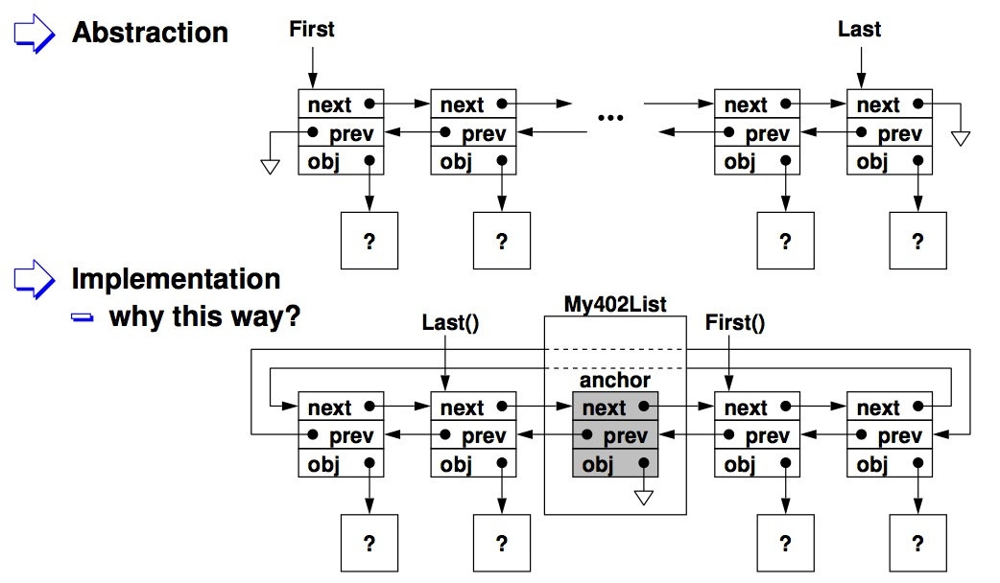
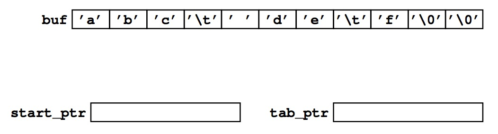
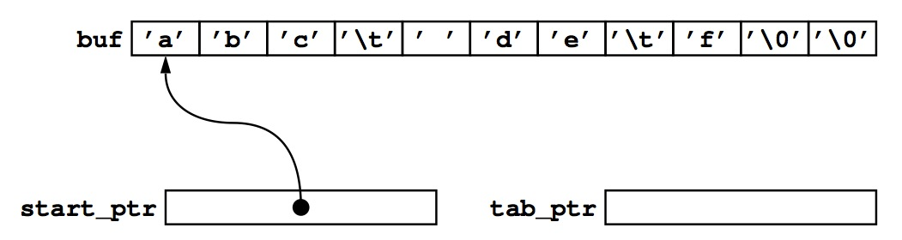
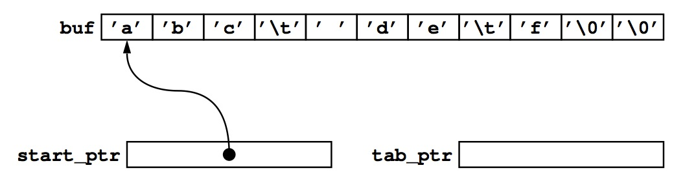
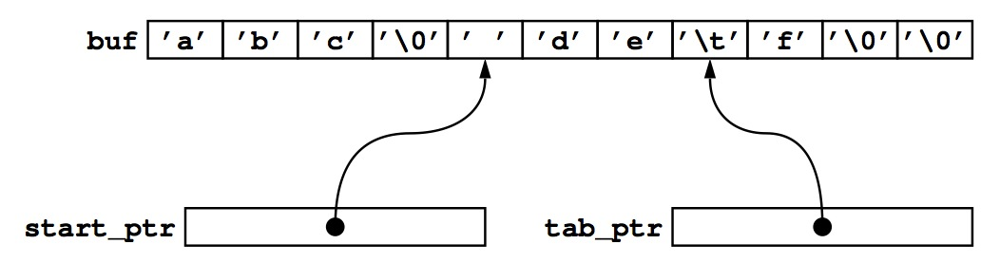
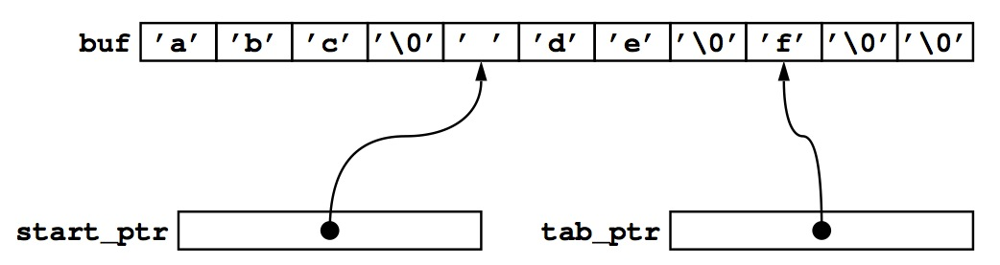
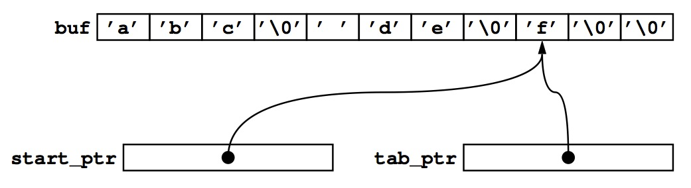

Operating Systems
=================

#### Warmup #1
###### Bill Chen
http://merlot.usc.edu/cs402-s13/

###### 2 parts
* develop a doubly-linked circular list called My402List
	- to implement a linked-list abstraction
* use your doubly-linked circular list to implement a command:
	- sort - sort a list of bank transactions

###### A Linked-List Abstraction
* A list of elements, linked so that you can move from one to the next (an
d/or previoius)
	- each element holds an object of some sort

* Functionally:
	- First() 
	- Next() 
	- Last() 
	- Prev() 
	- Insert() 
	- Remove() 
	- Count()

* Need to have a well-defined interface
	- once you have a good interface, if the implementation is broken, fix the implementation!
	- don’t fix the "application"

* There are basically two types of lists

	1) next/prev pointers in list items

	2) next/prev pointers outside of list items

	(1) has a major drawback that a list item cannot be inserted into multiple lists
	We will implement (2)

###### Doubly-linked Circular List

###### my402list.h
	#ifndef _MY402LIST_H_
	#define _MY402LIST_H_
	#include "cs402.h"
	typedef struct tagMy402ListElem {
	    void *obj;
	    struct tagMy402ListElem *next;
	    struct tagMy402ListElem *prev;
	} My402ListElem;
	typedef struct tagMy402List {
	    int num_members;
	    My402ListElem anchor;
	    /* You do not have to set these function pointers */
	    int  (*Length)(struct tagMy402List *);
	    int  (*Empty)(struct tagMy402List *);
	    int  (*Append)(struct tagMy402List *, void*);
	    int  (*Prepend)(struct tagMy402List *, void*);
	    void (*Unlink)(struct tagMy402List *, My402ListElem*);
	    void (*UnlinkAll)(struct tagMy402List *);
	    int  (*InsertBefore)(struct tagMy402List *, void*, My402ListElem*);
	    int  (*InsertAfter)(struct tagMy402List *, void*, My402ListElem*);
	    My402ListElem *(*First)(struct tagMy402List *);
	    My402ListElem *(*Last)(struct tagMy402List *);
	    My402ListElem *(*Next)(struct tagMy402List *, My402ListElem *cur);
	    My402ListElem *(*Prev)(struct tagMy402List *, My402ListElem *cur);
	    My402ListElem *(*Find)(struct tagMy402List *, void *obj);
	} My402List;
	extern int  My402ListLength(My402List*);
	extern int  My402ListEmpty(My402List*);
	extern int  My402ListAppend(My402List*, void*);
	extern int  My402ListPrepend(My402List*, void*);
	extern void My402ListUnlink(My402List*, My402ListElem*);
	extern void My402ListUnlinkAll(My402List*);
	extern int  My402ListInsertAfter(My402List*, void*, My402ListElem*);
	extern int  My402ListInsertBefore(My402List*, void*, My402ListElem*);
	extern My402ListElem *My402ListFirst(My402List*);
	extern My402ListElem *My402ListLast(My402List*);
	extern My402ListElem *My402ListNext(My402List*, My402ListElem*);
	extern My402ListElem *My402ListPrev(My402List*, My402ListElem*);
	extern My402ListElem *My402ListFind(My402List*, void*);
	extern int My402ListInit(My402List*);
	#endif /*_MY402LIST_H_*/

###### Implementation

	int Length() { return num_members; }
	int Empty() { return num_members<=0; }
	int Append(void *obj);
	int Prepend(void *obj);
	void Unlink(My402ListElem*);
	void UnlinkAll();
	int InsertBefore(void *obj, My402ListElem *elem);
	int InsertAfter(void *obj, My402ListElem *elem);
	My402ListElem *First();
	My402ListElem *Last();
	My402ListElem *Next(My402ListElem *cur);
	My402ListElem *Prev(My402ListElem *cur);
	My402ListElem *Find(void *obj);

###### Traversing the List

	void Traverse(My402List *list)
	{
	  My402ListElem *elem=NULL;
	  for (elem=My402ListFirst(list);
	       elem != NULL;
	       elem=My402ListNext(list, elem)) {
	    Foo *foo=(Foo*)(elem->obj);
	    /* access foo here */
	  }
	}

* This is how an application will use My402List
	- you must support your application

###### listtest
* Use provided listtest.c and Makefile to create listtest
	- listtest must run without error and you must not change listtest.c and Makefile
	- They specifies how your code is expected to be used

* You should learn how to run listtest under gdb

###### Sort Command
* warmup1 sort [tfile]
	- Produce a sorted transaction history for the transaction records in tfile (or stdin) and compute balances

* Input is an ASCII text file
	Each line in a tfile contains 4 fields delimited by <TAB>
		- transcation type (single character)

			"+" for deposit

			"-" for withdrawal

		- transcation time (UNIX time)

			man -s 2 time

		- amount (a number, a period, two digits)
		- transcation description (textual description)

			cannot be empty

###### Reading Text Input
* Read in an entire line using fgets()
	- especially since we know the maximum line length, according to the spec

* If a filename is given, use fopen() to get a file pointer (FILE*)

	FILE *fp = fopen(..., "r");

	- read man pages of fopen()
	- if a filename is not given, you will be reading from "standard input" (i.e., file descriptor 0)

		FILE *fp = stdin;

	－ pass the file pointer around so that you run the same code whether you input comes from a file or stdin

		My420List list;
	    if (!My402ListInit(&list)) { /* error */ }
	    if (!ReadInput(fp, &list)) { /* error */ }
	    if (fp != stdin) fclose(fp);
	    SortInput(&list);
	    PrintStatement(&list);

###### Parsing Text Input
* Read a line
	
	char buf[1026];
       if (fgets(buf, sizeof(buf), fp) == NULL) {
         /* end of file */
       } else {
         /* parse it */
	}

* Parse a line according to the spec
	- find an easy and correct way to parse the 

		according to the spec, each line must have exactly 3 <TAB> characters

		I think it’s easy and correct to go after this

			char *start_ptr = buf;
			char *tab_ptr = strchr(start_ptr, ’\t’);
			if (tab_ptr != NULL) {
			  *tab_ptr++ = ’\0’;
			}
			/* start_ptr now contains a
			321 0
			"null-terminated string" */
			char *start_ptr = buf;
			char *tab_ptr = strchr(start_ptr, ’\t’);
			if (tab_ptr != NULL) {
			  *tab_ptr++ = ’\0’;
			}
			/* start_ptr now contains a
			   "null-terminated string" */

###### Validate Input
* Make sure every null-terminated string contains the right kind of value
	- if incorrect, print a reasonable error message and quit your program

		ideally, you should clean up all your data structures (not required for an assignment like this one)

* After all fields are validated, you can put them in one data structure
	- allocate memory for this data structure and copy the fields into it
	- append pointer to this data structure to list

		any pointer is compatible with (void*)

		alternately, you can perform insertion sort by finding the right place to insert this pointer and call one of the insert functions of My402List

###### Sort Command
* Output

* How to keep track of balance
	- First thing that comes to mind is to use double
	- The weird thing is that if you are not very careful with double, your output will be wrong (by 1 penny) once in a while
	- Recommendation: keep the balance in cents, not dollars

		No precision problem with integers!

* The spec requires you to call ctime() to convert a Unix timestamp to string
	- then pick the right characters to display as date
	- e.g., ctime() returns "Thu Aug 30 08:17:32 2012\n"

		becareful, ctime() returns a pointer that points to a global variable, so you must make a copy

		char date[16];
		char buf[26];
		strncpy(buf, sizeof(buf), ctime(...));
		date[0] = buf[0];
		date[1] = buf[1];
		...
		date[15] = ’\0’;

* Format your data in your own buffer
	- write a function to "format" numeric fields into null-terminated strings

		it’s a little more work, but you really should have this code isolated

		in case you have bugs, just fix this function

	- you can even do the formatting when you append or insert your data structure to your list

		need more fields in your data structure

	- this way, you can just print things out easily
	- use printf("%s", ...) to print a field to stdout

###### README
* I included one more .h file, the my402data.h to store some variable.
* But all the compile command is included in the Makefile.
* Just "make warmup1" or "make" can compile my code.

