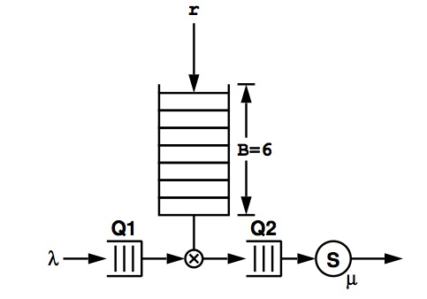
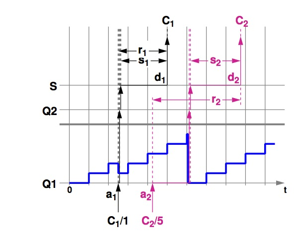
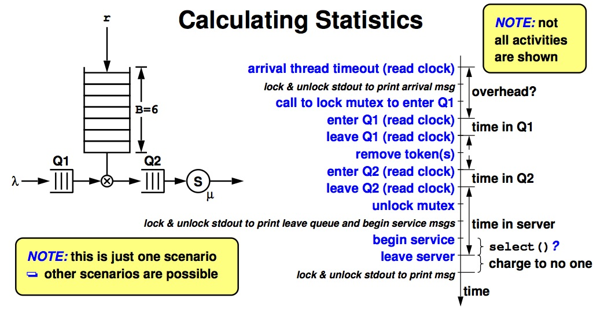

Operating Systems
=================

#### Warmup #2
###### Bill Chen
http://merlot.usc.edu/cs402-s13/

###### Multi-threading Exercise
* Make sure you are familiar with the pthreads library
	- Ch 2 of textbook - threads, signals
		* additional resource is a book by Nichols, Buttlar, and Farrell "Pthreads Programming", O'Rielly & Associates, 1996

* you must learn how to use mutex and condition variables correctly
	- pthread_mutex_lock()/pthread_mutex_unlock()
	- pthread_cond_wait()/pthread_cond_signal()/pthread_cond_broadcast()

* you must learn how to handle UNIX signals
	- pthread_sigmask()/sigwait()
	- pthread_kill()

* if you want to use "thread cancellation"
	- pthread_setcancelstate()
	- pthread_setcanceltype()
	- pthread_testcancel()

###### Token Bucket Filter

* EX
	- ticket scalper?!
	- traffic controller

###### Arrivals & Departures
- ai : arrival time
- di : departure time
- si : service time
- ri : response (system) time 
- qi : queueing/waiting time

- r1 = d1 - a1

- r2 = d2 - a2

- r3 = d3 - a3

###### Event Driven Simulation
* An event queue is a sorted list of events according to timestamps; smallest timestamp at the head of queue
* Object oriented: every object has a "next event" (what it will do next if there is no interference), this event is inserted into the event queue
* Execution: remove an event from the head of queue, "execute" the event (notify the corresponding object so it can insert the next event)
* Insert into the event queue according to timestamp of a new event; insertion may cause additional events to be deleted or inserted
* Potentially repeatable runs (if the same seed is used to initialize random number generator)

###### Time Driven Simulation
* Every active object is a thread
* To execute a job for x msec, the thread sleeps for x msec
	- nunki.usc.edu does not run a realtime OS
	- it may not get woken up more than x msec later, and sometimes, a lot more than x msec later
		* you need to decide if the extra delay is reasonable or it is due to a bug in your code
* Let your machine decide which thread to run next (irreproducible results)
* Compete for resources (such as Q1), must use mutex
* You will need to implement 3 threads (or 1 main thread and 3 child threads)
	- the arrival thread sits in a loop
		* sleeps for an interval, trying to match a given interarrival time (from trace or deterministic)
		* wakes up, creates a packet object, locks mutex
		* enqueues the packet to Q1 or Q2
		* if Q2 was empty before, need to signal or broadcast a queue-not-empty condition
		* unlocks mutex
		* goes back to sleep for the "right" amount
	- the server thread
		* initially blocked, waiting for the queue-not-empty condition to be signaled
		* when unblocked, mutex is locked
		* if Q2 is not empty, dequeues a packet and unlock mutex
			- sleeps for an interval matching the service time of the packet, eject the packet from the system
			- lock mutex, check if Q2 is empty, etc.
		* if Q2 is empty, go wait for the queue-not-empty condition to be signaled
	- the token arrival thread sits in a loop
		* sleeps for an interval, trying to match a given interarrival time for tokens
		* wakes up, locks mutex, try to increment token count
		* check if it can move a packet from Q1 to Q2
		* if packet is added to Q2 and Q2 was empty before, signal or broadcast a queue-not-empty condition
		* unlocks mutex
		* goes back to sleep for the "right" amount
* Dropped packets
	- if the token requirement for an arriving packet is too large, drop the packet
* Dropped tokens
	- if an arriving token finds a full bucket, it is dropped
* Other requirements
	- please read the spec!

- time between begin service and leave server is the amount of time in select() or usleep()

###### SIGINT
* &lt;Cntrl+C&gt;
	- arrival thread will stop generating packets and terminate
		* the arrival thread needs to stop the token thread
		* the arrival thread needs to clear out Q1 and Q2
	- server threads must finish serving its current packet
	- must print statistics for all packet seen
		* need to make sure that packets deleted this way do not participate in certain statistics calculation
			- you need to decide which ones and justify them

###### Designate A Thread To Catch A Signal
* Look at the man pages of pthread_sigmask() on nunki and try to understand the example there
	- designate child thread to handler SIGINT
	- parent thread blocks SIGINT

			#include <pthread.h>
			/* #include <thread.h> */
			thread_t user_threadID;
			sigset_t new;
			void *handler(), interrupt();
			main( int argc, char *argv[] )  {
				sigemptyset(&new);
				sigaddset(&new, SIGINT);
				pthread_sigmask(SIG_BLOCK, &new, NULL);
				pthread_create(&user_threadID, NULL, handler, argv[1]);
				pthread_join(user_threadID, NULL);
				printf("thread handler, %d exited\n",user_threadID);
				sleep(2);
				printf("main thread, %d is done\n", thr_self());
			} /* end main */

###### pthread_sigmask()
* Child thread example
	- child thread unblocks SIGINT

			struct sigaction act;
			void *
			handler(char argv1[])
			{
				act.sa_handler = interrupt;
				sigaction(SIGINT, &act, NULL);
				pthread_sigmask(SIG_UNBLOCK, &new, NULL);
				printf("\n Press CTRL-C to deliver SIGINT\n");
				sleep(8);  /* give user time to hit CTRL-C */
			}
			void
			interrupt(int sig)
			{
				printf("thread %d caught signal %d\n", thr_self(), sig);
			}

	- child thread is designated to handle SIGINT, no other thread will get SIGINT

###### README
* I included one more .h file, the warmup2.h to store some variables and structures.
* But all the compile command is included in the Makefile.
* Just "make warmup2" or "make" can compile my code.
