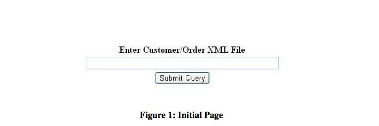
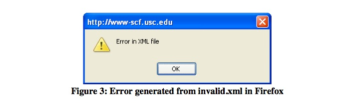
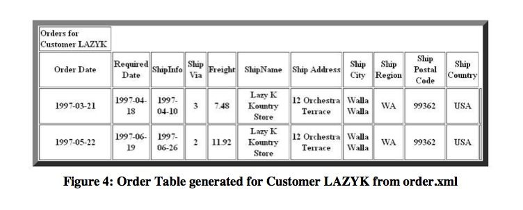

Web Technologies
================

### Homework: XML Exercise

#### 1. Objectives

* Become familiar with the DOM paradigm;
* Use an existing XML parser;
* Transform the content of an XML document into an HTML page.

#### 2. Description
You are required to write a HTML/JavaScript program, which takes the URL of an XML document containing Customer and Order information, parses the XML file, and extracts the list of Customers, displaying them in a table. The viewer may select any one of the Customers and your program will extract from the XML file the orders corresponding to the selected Customer. The JavaScript program will be embedded in an HTML file so that it can be executed within a browser.

* Your program should display a text box to enter the XML file name as shown below on Figure 1. On clicking the “Submit Query” button, it should pop up a new window, which would display the table as shown below, Figure 2. If the text box is left empty and Submit Query is clicked, an appropriate error message must be shown. 

* Once the XML file downloads, a JavaScript function within the HTML file parses the XML document that was passed as an input to the popped up window.
* After parsing the XML document, a table should be displayed consisting of a portion of the data for all Customers that are contained in the XML file. For example, given the following XML document: http://www-scf.usc.edu/~csci571/2012Fall/hw4/order.xml

The table below should be displayed:

Here is a portion of the order.xml file containing some of the Customer data that is displayed above:

	<Root>
		<Customers>
			<Customer CustomerID="GREAL">
				<CompanyName>Great Lakes Food Market</CompanyName>
				<ContactName>Howard Snyder</ContactName>
				<ContactTitle>Marketing Manager</ContactTitle>
				<Phone>(503) 555-7555</Phone>
				<FullAddress>
					<Address>2732 Baker Blvd.</Address>
					<City>Eugene</City>
					<Region>OR</Region>
					<PostalCode>97403</PostalCode>
					<Country>USA</Country>
				</FullAddress>
			</Customer>
			<Customer CustomerID="HUNGC">
				<CompanyName>Hungry Coyote Import Store</CompanyName>
				<ContactName>Yoshi Latimer</ContactName>
				<ContactTitle>Sales Representative</ContactTitle>
				<Phone>(503) 555-6874</Phone>
				<Fax>(503) 555-2376</Fax>
				<FullAddress>
					<Address>City Center Plaza 516 Main St.</Address>
					<City>Elgin</City>
					<Region>OR</Region>
					<PostalCode>97827</PostalCode>
					<Country>USA</Country>
				</FullAddress>
			</Customer>
			<Customer CustomerID="LAZYK">
				<Customer CustomerID="LETSS">
				</Customers>

#### 3. Error Handling
In case of a parsing error, your program should show an alert box indicating an error was detected. For example if you try to load the incorrectly formatted XML file:
http://www-scf.usc.edu/~csci571/2012Fall/hw4/invalid.xml
then you should show an alert box if the XML file is not valid, as in the following figure:

Other error conditions that should be checked for are: an XML file containing NO customers, an XML file containing an order for a Customer who is not listed. No other error conditions need be checked. In all cases if an error is found your program should show an alert box indicating the error was detected.

#### 4. Normal Processing
After you output the table of Customers, a viewer may select one of the Customers and click on Submit. Your JavaScript program should then re-examine the XML file and produce a new table, one that contains all of the orders associated with the selected Customer. For example if the viewer clicks on LAZYK your program should produce the following table:

Here is a portion of the order.xml file containing the order data for Customer LAZYK:

	<Order>
		<CustomerID>LAZYK</CustomerID>
		<EmployeeID>1</EmployeeID>
		<OrderDate>1997-03-21</OrderDate>
		<RequiredDate>1997-04-18</RequiredDate>
		<ShipInfo Shipped Date="1997-04-10">
			<ShipVia>3</ShipVia>
			<Freight>7.48</Freight>
			<ShipName>Lazy K Kountry Store</ShipName>
			<ShipAddress>12 Orchestra Terrace</ShipAddress>
			<ShipCity>Walla Walla</ShipCity>
			<ShipRegion>WA</ShipRegion>
			<ShipPostalCode>99362</ShipPostalCode>
			<ShipCountry>USA</ShipCountry>
		</ShipInfo>
	</Order>
	<Order>
		<CustomerID>LAZYK</CustomerID>
		<EmployeeID>8</EmployeeID>
		<OrderDate>1997-05-22</OrderDate>
		<RequiredDate>1997-06-19</RequiredDate>
		<ShipInfo ShippedDate="1997-06-26">
			<ShipVia>2</ShipVia>
			<Freight>11.92</Freight>
			<ShipName>Lazy K Kountry Store</ShipName>
			<ShipAddress>12 Orchestra Terrace</ShipAddress>
			<ShipCity>Walla Walla</ShipCity>
			<ShipRegion>WA</ShipRegion>
			<ShipPostalCode>99362</ShipPostalCode>
			<ShipCountry>USA</ShipCountry>
		</ShipInfo>
	</Order>

#### 5. Hints

* Step 1: Writing Your HTML/JavaScript program - Using the DOM Parser

Here's how you could use the Microsoft DOM API and the Mozilla DOM API (used in Firefox) to load and parse an XML document into a DOM tree, and then use the DOM API to extract information from that document.

	

Now you can generate the HTML table from the DOM tree. You can assume that every xml file containing Customers and Orders will have identical tag names. However, the Customer entries and the Order entries may occur interchangeably. If there are no Customers than there are no orders. If at least one Customer is contained in the XML file then there must be at least one order associated with that Customer.

Your task is to write a program that transforms this structure into the Customer and Order tables as shown above.

For example you can access the child nodes of the documents as follows:
	
	footb = xmlDoc.documentElement.childNodes;

Note that unlike the Java-based DOM, which provides methods such as getChildNodes( ) and getNodeType( ) that return respectively a node list of children of a current node and the type of a node, with the DOM you have to access the element properties directly, as in:

	footbNodeList = footb.item(i).childNodes;
	if (footbNodeList.item(j).nodeType == ELEMENT_NODE)

Below is the link to the web page that demonstrates how to handle white spaces in Mozilla:

http://developer.mozilla.org/en/docs/Whitespace_in_the_DOM

* Step 2: Display the Resulting HTML Document

You should use the DOM document.write method to output the required HTML.

* Step 3: Use JavaScript control syntax

The only program control statements that you will need to use for this exercise are the “if” and the “for” statements. The syntax of both statements is practically identical to the syntax of the corresponding statement in the C, C++ and Java languages, as in:

	if (footbNodeList.item(j).nodeName=="image") {
		// do stuff
	}
	for (j=0;j<footbNodeList.length;j++) {
		// do more stuff
	}

Please make a note of the following issue:

#### Cross-Site Scripting (XSS):
Javascript cannot call the resources from another domain. This is called cross side scripting which is not allowed in browsers. Therefore, you must put your XML files and your script in the same domain. Please make sure, when you are testing your implementation, to place both the HTML file and the XML file on your local machine IN THE SAME FOLDER. The files can be copied from here:

http://www-scf.usc.edu/~csci571/2012Fall/hw4/invalid.xml

http://www-scf.usc.edu/~csci571/2012Fall/hw4/order.xml

Also

Be aware that you cannot use "XMLHttpRequest" in your homework #4. It is sufficient to use the xml.load( ) function to read an XML file.

Window.open() method must be used to pop up a new window which would display the final widget.

#### Description of HTML:
My initial page will show a input text area and a submit button same as the page in the requirement pdf file. And my table page is generated by code.

#### Description of JavaScript Code:
In my javascript code, I used function of urlQuery to examine the web URL, if it contains URL parameter, urlQuery will use document.write to generate a customer table according to the URL parameter, or urlQuery will do nothing and just display the initial page.

In the initial page, it will call the function of submitQuery if user click the submit button, submitQuery will use DOM API to load and parse the XML located in the URL user input in the text box, and submitQuery will give error alert if user left the text box empty, given the invalid XML file or the XML file didnot contain customer node, submitQuery also use a try catch to prevent some other kind of error, like the URL didnot exist, etc.

If the XML user provided is correct, this program will open a new window and pass it the URL paramter. In the new open page, urlQuery were called and load the XML file again(here I didn't pass the XML as a parameter, I think it is not security and not appropriate by my way of passing parameter, so I load the XML again) and would display the customer table according to URL parameter by code. And then user can select a customer by radio button, corresponding customer order information will display if clicking submit by function of submitCustID. There are also a alert of error if user dosen't chose any customer or the XML didn't contain the order of the customer user selected. If the user click the button again, submitCustID will delete the last order table and display new one(I believe it is a proper way to show it since the requirements didn't say where we should put it). In addition, if some node are null the function of removeNull will replace "null" to "N/A".

#### Alert Box:
I have checked follow errors, and pop an alert box.

1. User left the input box empty in the initial page.
2. XML file is invalid.
3. XML file doesn't contain customer node.
4. There are orders whose customer doesnot exist.
5. User doesn't select any customer in the second page.
6. The customer user selected doesn't have order.
