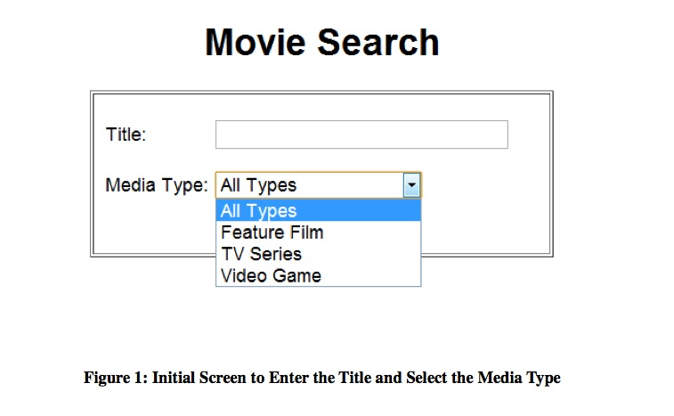
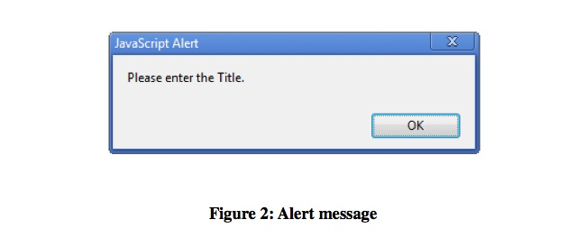
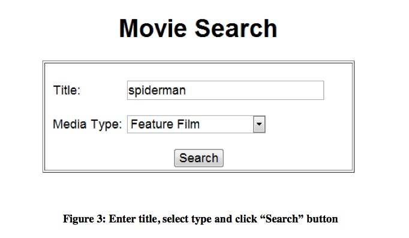
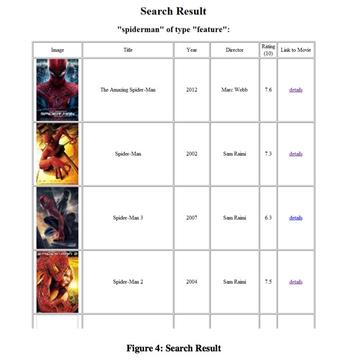
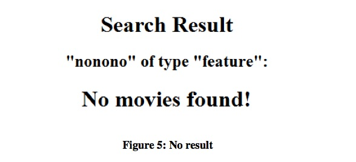

Web Technologies
================

### Homework 6: Server-side Scripting

#### 1. Objectives

* Get experience with Perl or PHP programming language;
* Get experience with CGI programming;
* Get experience parsing text using regular expressions

#### 2. Description
In this exercise, you are asked to create a webpage, which allows you to search for a movie or TV series from the Internet Movie Database (IMDb). The information is scraped from the website http://www.imdb.com, and the results will be displayed in the tabular format.

A user will first open the page, called movie_search.html, where he/she can enter the title of the movie or TV series, then select the corresponding type he/she is looking for. For the same name, there may exist many media of different types. If the type does not matter, select “All Types”. An example is shown in Fig 1.

After the user has entered the title and media type and then clicks the “Search” button, your program will check if the user has entered any title or not. If the user did not enter any title name and clicked on “Search”, then an alert message should be shown and ask the user to input again. The list should contain the four different media types shown including “all types”. Make one of them to be default-selected. The example of the alert message is shown in Figure 2, and a valid input is shown in Figure 3.

When the title name is not empty, clicking on the Search button will call a Perl (or PHP) script, for example, get_movies.pl. This script will grab the data sent from the html page (movie_search.html) and send the movie information to the IMDb website (http://www.imdb.com). The way it works is: the Perl script will use the data (title name and media type) to construct a URL to the IMDb website: For example, if you enter “spiderman” and choose “Feature Film”, then the URL would look like this:

http://www.imdb.com/search/title?title=spiderman&title_type=feature

For the detailed information about constructing the URL, you should go to “Advanced Title Search” function which can be found in the following site,

http://www.imdb.com/search/title

The Perl script will use a library, called LWP, to retrieve the resulting web page from IMDb. Next the Perl script will use regular expressions to extract the following data:

1. The exact title of the movie
2. The release year
3. The movie poster (small icon)
4. The rating (number of stars)
5. The director name(s)
6. The link to the specific movie

For at most five (5) movies listed that match the title and media type. After extracting the data the script will create a web page that displays the data in the format of a table. A sample output is shown below:

You only need to display the first five results returned by IMDb.

Details are as follow.

* The first column of the table shows the poster of the movie/TV.
* The second column displays the name of the movie/TV.
* The third column displays the release year.
* The fourth column displays the director of the movie/TV. If there are no directors, you can display “N.A.”.
* In the fifth column, the number indicates the rating of the movie, which is from 0 to 10;
* The last column allows the user to click to go to the website that shows the details of the movie, e.g. http://www.imdb.com/title/tt0948470/
* If a movie title is entered for which there is no result, for example, “nonono”, instead of the table, a message should be displayed to show that there is no result for the query. See Fig 5.

Some notes:

* You should not use any XML or HTML parsers in Perl or PHP. You should write your own parsing code. Also, all parsing (or scraping) of the web page (or any web page) should be done using Perl regular expressions, and NOT using any Perl libraries especially designed to simplify parsing web pages. This is not to be confused with Perl standard functions, which you are free to use. Examples of such functions are split, print etc.

#### 3. Hints
To retrieve a web page you can use the Perl LWP module, and to show special characters correctly you can set Metadata indicating UTF-8.

	#!/usr/bin/perl -w
	...
	# Add a header directive indicating that this is encoded in UTF-8
	print "<meta http-equiv=\"Content-Type\" content=\"text/html;
	charset=UTF-8\"/>\n";
	...
	# Check whether LWP module is installed
	if(eval{require LWP::Simple;}){
	}else{
	print "You need to install the Perl LWP module! ";
	exit;
	}
	...
	# Retrieve the content of an URL
	$url = "http://XXXXXX";
	$content = LWP::Simple::get($url);

Other error conditions that should be checked for are: an XML file containing NO customers, an XML file containing an order for a Customer who is not listed. No other error conditions need be checked. In all cases if an error is found your program should show an alert box indicating the error was detected.

#### 4. Options
Students may use either Perl or PHP to implement this assignment. There are several important points that student must pay attention to:

* If you choose PHP we won’t be able to provide full support, such as answering your detailed questions regarding those two languages. We will, however, try our best to help you finish the assignment. You can always post your questions on PIAZZA; instructors will be happy to assist you. Other students, who are experts in PHP can also help you on PIAZZA.
* Please, explain your implementation (script languages, files...) in the README file.
