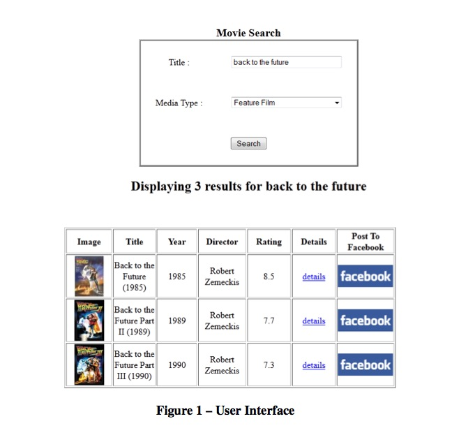
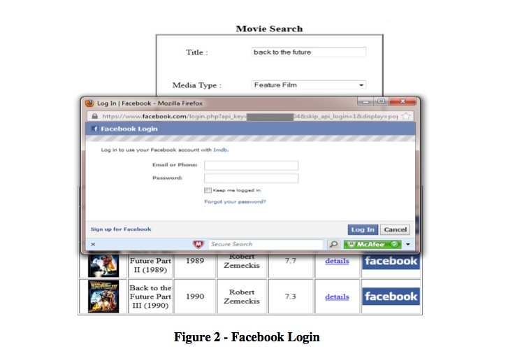
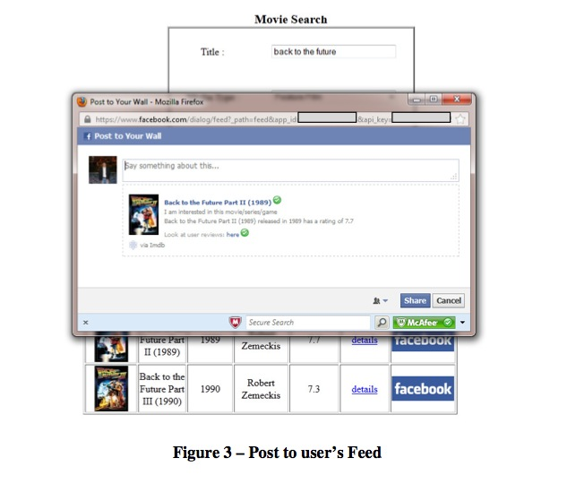
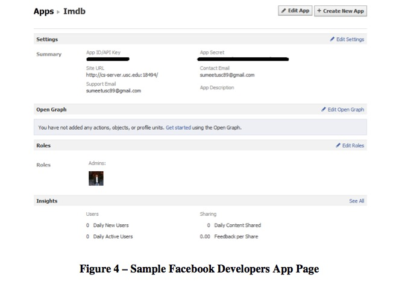

Web Technologies
================

### Homework: IMDB & Facebook Mashup – an AJAX/JSON/Java Exercise

#### 1. Objectives

* Become familiar with the AJAX, REST, JSON& XML technologies.
* Use a combination of HTML, CSS, DOM, XMLHttpRequest, XML and Java Servlets.
* Provide an interface to search and display movies or TV series from imdb.com and post them to Facebook.

#### 2. Background
##### 2.1 AJAX & JSON
AJAX (Asynchronous JavaScript + XML) incorporates several technologies:

* Standards-based presentation using XHTML and CSS;
* Dynamic display and interaction using the Document Object Model (DOM);
* Data interchange and manipulation using XML and XSLT;
* Asynchronous data retrieval using XMLHttpRequest;
* JavaScript binding everything together.

See the class slides at http://www-scf.usc.edu/~csci571/Slides/ajax.ppt.

JSON, short for JavaScript Object Notation, is a lightweight data interchange format. Its main application is in AJAX web application programming, where it serves as an alternative to the use of the XML format for data exchange between client and server. See the class slides at http://www-scf.usc.edu/~csci571/Slides/JSON1.ppt.

##### 2.2. IMDB
imdb.com is the world's most popular and authoritative source for movie, TV and celebrity content.

The imdb homepage is available at:

http://www.imdb.com/

In Homework #6 a Perl or PHP script together with your Apache server provided the “scrape” functionality. In this exercise you will re-use your scraping code to produce XML instead of HTML as you did in homework #6.

##### 2.3 Facebook
Facebook is a global social networking website that is operated and privately owned by Facebook, Inc. Users can add friends and send them messages, and update their personal profiles to notify friends about themselves and what they are doing.

Users can additionally post news feeds to their profiles, and these feeds may include images, besides text messages.

The Facebook homepage is available at:

http://www.facebook.com

Facebook provides developers with an API called the Facebook Platform. Facebook Connect is the next iteration of Platform, which provides a set of API's that enable Facebook members to log onto third-party websites, applications and mobile devices with their Facebook identity. While logged in, users can connect with friends via these media and post information and updates to their Facebook profile.

Below are few links for Facebook Connect:

http://developers.facebook.com/blog/post/108/

http://developers.facebook.com/docs/guides/web/

#### 3. Description of the Exercise
In this exercise, you will write a web application that does the following sequence of actions:

1. Allows a user to enter a “query” regarding information from imdb.com; the query will contain a title and a type. The type can be one of the following: All Types, Feature Film, TV Series or Video Game; (Refer Figure 1)
2. Uses the query string to retrieve appropriate information from imdb.com, using the modified Perl or PHP script from Homework #6;
3. Displays the media information in a table format similar to the format used in Homework #6; (Refer Figure 1)
4. Allows the user to select a particular entry and Post it to Facebook by clicking on “Facebook” button;
5. Authorizes the user to login to Facebook;
6. Posts a feed of the media’s information to a user’s Facebook wall using the Facebook Connect API. The feed to be posted includes a “title” (i.e. media name); a description containing the year, rating, image and a link to user reviews. The title will hyperlink to the media information.

For example:
	The title Spiderman will be followed by the following description:
	“I am interested in this movie/series/game.
	Spiderman released in 2012 has a rating of 7.6.
	Look at user reviews : here”
	In the above message the title (i.e. Spiderman) will link to the movie page on imdb.com and reviews link (i.e. here) will link to user reviews page for that movie.

Users can enter the message of their choice in the message box. (Refer Figure 3 for more details on the format of the message to be displayed).

A snapshot of the initial user interface, together with a query and the resultant table, is shown in Figure 1.

To implement this exercise you are required to write a combination of HTML, JavaScript and Java Servlet programs. The top-level interface consists of three areas:

* A Form area including a text area to enter the title, a dropdown to select the type of the media you want to search and a “Search” button;
* A dynamic area that displays a table with the media information corresponding to the query along with additional properties of the media (cover, title, year, rating, director along with the link to view the details);
* A “Facebook” button that posts the details, corresponding to the selected entry, to a user’s feed page.

Once title has been entered in the edit box along with the selection of the type, and the “Search” button is pressed, the form calls a JavaScript function. This function first performs basic validation of the input. If the input is empty, the request is not forwarded to the Java Servlet. Instead an alert with an error message is presented to the user, asking to refine the search. Once the validation is successful, the JavaScript function executes XMLHttpRequest to start an asynchronous transaction with a Java Servlet running under Tomcat, and passing the “query strings” as parameters of the transaction.

The Java Servlet in turn performs the following three steps:

First, the Java Servlet extracts the query string and then it calls the Perl or PHP script, modified after Homework #6, to retrieve data from imdb.com corresponding to the title and type included in the query. For example, if your server was using port XXXX, a query of the following type will be generated:

If title = spiderman, title_type = Feature Film

http://cs-server.usc.edu:XXXX/cgi-bin/script.pl?title=spiderman&title_type=feature

Secondly, the Perl or PHP script would return the XML of the following type:

	<rsp stat="ok">
	<results total="5">
	<result cover="http://ia.media- imdb.com/images/M/MV5BMjMyOTM4MDMxNV5BMl5BanBnXkFtZTcwNjIyNzExOA@@._V1._SX54_ CR0,0,54,74_.jpg" title="The Amazing Spider-Man(2012)"year="2012" director="Marc Webb" rating="7.5" details="http://www.imdb.com/title/tt0948470"/>
	<result cover="http://ia.media- imdb.com/images/M/MV5BMzk3MTE5MDU5NV5BMl5BanBnXkFtZTYwMjY3NTY3._V1._SX54_CR0, 0,54,74_.jpg" title="Spider-Man(2002)" year="2002"director="Sam Raimi" rating="7.3" details="http://www.imdb.com/title/tt0145487"/>
	<result cover="http://ia.media- imdb.com/images/M/MV5BODUwMDc5Mzc5M15BMl5BanBnXkFtZTcwNDgzOTY0MQ@@._V1._SX54_ CR0,0,54,74_.jpg" title="Spider-Man 3 (2007)" year="2007" director="Sam Raimi" rating="6.3" details="http://www.imdb.com/title/tt0413300"/>
	<result cover="http://i.media- imdb.com/images/SF1f0a42ee1aa08d477a576fbbf7562eed/realm/feature.gif" title=" The Amazing Spider-Man 2 (2014)" year="2014" director="Sam Raimi" rating="6.3" details="http://www.imdb.com/title/tt1872181"/>
	<result cover="http://ia.media- imdb.com/images/M/MV5BMjE1ODcyODYxMl5BMl5BanBnXkFtZTcwNjA1NDE3MQ@@._V1._SX54_ CR0,0,54,74_.jpg" title="Spider-Man 2 (2004)" year="2004" director="Sam Raimi" rating="7.5" details="http://www.imdb.com/title/tt0316654"/>
	</results>
	</rsp>

Notice that in Homework #6 your Perl or PHP script produced HTML. In this exercise, the output must be changed to XML.

Now, the Java Servlet extracts media information from this XML.

Lastly, the Java Servlet produces a JSON string that is returned asynchronously to the original XMLHttpRequest.

The format of the JSON string that needs to be generated is as follows:

	{"results":{
	"result":[
	{"cover":"http://ia.media- imdb.com/images/M/MV5BMjMyOTM4MDMxNV5BMl5BanBnXkFtZTcwNjIyNzExOA@@._V1._SX54_ CR0,0,54,74_.jpg", "title":"The Amazing Spider-Man (2012)", "year":"2012", "director":"Marc Webb", "rating":"7.5", "details":"http://www.imdb.com/title/tt0948470" },
	{"cover":"http://ia.media- imdb.com/images/M/MV5BMzk3MTE5MDU5NV5BMl5BanBnXkFtZTYwMjY3NTY3._V1._SX54_CR0, 0,54,74_.jpg", "title":"Spider-Man (2002)", "year":"2002", "director":"SamRaimi", "rating":"7.3", "details":"http://www.imdb.com/title/tt0145487" },
	{"cover":"http://ia.media- imdb.com/images/M/MV5BODUwMDc5Mzc5M15BMl5BanBnXkFtZTcwNDgzOTY0MQ@@._V1._SX54_ CR0,0,54,74_.jpg", "title":"Spider-Man 3 (2007)", "year":"2007", "director":"SamRaimi", "rating":"6.3", "details":"http://www.imdb.com/title/tt0413300" },
	{"cover":"http://i.media- imdb.com/images/SF1f0a42ee1aa08d477a576fbbf7562eed/realm/feature.gif", "title":"The Amazing Spider-Man 2 (2014)", "year":"2014", "director":"SamRaimi", "rating":"6.3", "details":"http://www.imdb.com/title/tt1872181" },
	{"cover":"http://ia.media- imdb.com/images/M/MV5BMjE1ODcyODYxMl5BMl5BanBnXkFtZTcwNjA1NDE3MQ@@._V1._SX54_ CR0,0,54,74_.jpg", "title":"Spider-Man 2 (2004)", "year":"2004", "director":"SamRaimi", "rating":"7.5", "details":"http://www.imdb.com/title/tt0316654" }]} }

After obtaining the query results from the callback of XMLHttpRequest, the JavaScript program displays the table with the media information properties in the “dynamic” area of the web page. Also note, successive queries will clear the data of the dynamic area and overwrite it with new data.

Next, the user is allowed to click on “Facebook” button adjacent to a particular entry in the table. When the button is pressed, the web application does the following:

* Authorizes the user to Facebook (i.e. logs him/her in) using the application and user credentials if the user is not already logged in to Facebook;
* Posts a feed, which includes the title, image, year, rating and link to user reviews. (as mentioned in section 3f)
* The above two steps can be performed using the Facebook Connect API, using the JavaScript SDK, which provides a rich set of client-side functionality for accessing Facebook's server-side API calls. It is documented at :
	https://developers.facebook.com/docs/reference/javascript/

#### 4. Implementation Hints
##### Step 1: Writing your JavaScript Program – set up an Ajax transaction

The JavaScript invoked by the Search button click event should do all of the following:

* Assign the “callback” function;
* Assemble the “url” parameter of the GET request as a reference to the Java Servlet to be invoked:
	Eg url :http://cs-server.usc.edu:XXXXX/servlet/MyServlet?parameters
* Call the XMLHttpRequest method (see Ajax Slide 24) and create the request object.
* Prepare the GET XMLHttpRequest using the setRequestHeader method:

	req.open("GET", url, true);
	req.onreadystatechange = myCallback;
	req.setRequestHeader("Connection", "Close");
	req.setRequestHeader("Method", "GET" + url + "HTTP/1.1");

##### Step 2: Writing your JavaScript Program – Execute Ajax Transaction
The JavaScript should finally invoke the XMLHttpRequest send method (see Ajax slide 24).

The “callback” function should check for completion of the transaction (request readyState equal to 4 and status equal to 200 (see AJAX slide 27 and JSON slide 5); use eval() and the responseText method to retrieve the resulting JSON data (see JSON slide 5), and displaying the returned media information properties to the “dynamic” area.

##### Step 3: Use the Java Servlet to respond to XMLHttpRequest and retrieve the media information listings from imdb

The Java Servlet referred above as /servlet/MyServlet (see 1.c above) should be invoked using doGet().

The Java Servlet should do all of the following:

* Initiating a connection with the Perl or PHP script, using the Apache server from Homework #6, to retrieve the media listings by scraping imdb.com.

##### Step 4: Use the Java Servlet to retrieve the XML file content
You may have to use an XML parser (for example: JAXP). Steps to retrieve XML file contents are as follows:

Step a: Get the XML content based on the URL above in Step 3.a.

* You need to open a URL connection to get the file you want. To create a URL connection:

	URL url = new URL(urlString);
	URLConnectionurlConnection = url.openConnection();
	urlConnection.setAllowUserInteraction(false);
	InputStreamurlStream = url.openStream();
	//read content

Step b: Parse the XML file using an XML parser

* Any XML parser can be used to parse the XML file. You can use methods like getNodeName() to access these elements. A good choice might be the JDOM library, which you get from:

http://www.jdom.org/downloads/index.html

##### Step 5: Use the Java Servlet to process the XML data
As you parse the data, you will build an output string, converting the XML data into JSON format, as described in section 3.

Finally you will return the JSON as a single string to the calling JavaScript program. To easily create a JSON string, you might find useful the JSON-RPC library available at:

http://mirrors.ibiblio.org/pub/mirrors/maven/com.metaparadigm/jars/json-rpc-1.0.jar

The Java Servlet should handle exceptions such as MalformedURLException and IOException. The Java Servlet should also handle error responses sent from the Apache servlet and reply with an appropriate error, a JSON message to the initial JavaScript XMLHttpRequest. This way, the JavaScript callback function will be able to inform the user that an error has occurred.

##### Step 6: Writing your JavaScript Program – Post media details to Facebook

Once the media properties are displayed in the dynamic area, the user should be able to click on the “Facebook” button for the corresponding entry in the table.

##### Step 7: Writing your JavaScript Program – Authorize Facebook User
Once the user clicks on the Facebook button, the program invokes the Facebook Connect API and authorizes the user. The recommended API to use is FB.Init, which is documented at:

http://developers.facebook.com/docs/reference/javascript/FB.init/

Also look at the code listed under “Loading” in the JavaScript SDK page at:

https://developers.facebook.com/docs/reference/javascript/

##### Step 8: Writing your JavaScript Program – Post media information to Facebook News Feed
There are several methods to post a message to the user’s feed page (the “wall”).

One such method uses the Fb.ui() API with the feed dialog, documented at:

http://developers.facebook.com/docs/reference/javascript/FB.ui/

The feed dialog is documented at:

https://developers.facebook.com/docs/reference/dialogs/feed/

Once the user is authorized, and an appropriate session token has been obtained, the text of the selected media is posted to the user’s news feed page (the “wall”). A subsequent posting will not require the user to log in again.

Additional information that may be useful to you is available at Facebook for Websites web page:

https://developers.facebook.com/docs/guides/web/

##### Step 9 : Install the firefox add-on “Disable HTTP Referer at Startup”
By default, Imdb blocks scraping of images by looking at the Http-referer. If it sees that the request is not coming from their site, it either blocks or throttles access. As a result, when you try to access the image url in your code, the image is not displayed. The solution is to disable the http-referer by using a firefox addon called “Disable HTTP Referer at Startup”.

More information about HTTP Referer :

http://www.seomoz.org/ugc/the-http-referer-friend-or-foe

Here is the link for the add-on :

https://addons.mozilla.org/en-US/firefox/addon/disable-http-referer-at-sta/

#### 5. Prerequisites
This homework requires the use of the following components:

1. A servlet-based web server, Tomcat 4.1.27. Instructions on how to load Tomcat 4.1.27 can be found here:
http://www-scf.usc.edu/~csci571/2006Spring/tomcatinstall.html.
A tar version of Tomcat 4.1.27 can be found here:
http://www-scf.usc.edu/~csci571/download/jakarta-tomcat-4.1.27.tar.

2. The Java Servlet library (servlet-api.jar) to perform HTTP transactions using methods such as doGet() or doPost() from Java.
You may find it here :
http://repo1.maven.org/maven2/javax/servlet/servlet-api/2.5/

3. A Java XML parser library. You may use the JDOM 1.1.3, an object model that uses XML parsers to build documents, available in the Download section of the jdom website
http://www.jdom.org/downloads/index.html

4. You may also use JAXP, the Java API for XML Parsing. A good tutorial on JAXP is available at
http://www-106.ibm.com/developerworks/xml/library/x-jaxp1.html or http://docs.oracle.com/javase/tutorial/jaxp/intro/index.html

5. You need to create a Facebook Platform application:
	To do that you will need to add the Facebook Developer application: go to http://www.facebook.com/developers/, and click Create New App.
	Once you've added the Facebook Developer application to your account, you can begin creating your application for Facebook. You should be getting an API Key and Application Secret that you will have to use with the JavaScript Client Library FB.init API.

6. Download and install the “Disable Http-Referer at Startup” Addon in firefox.

#### 6. Deployment Structure
To write your own Java Servlets program using Tomcat 4.1.27, you need to:

1. Successfully install Tomcat 4.1.27 on your machine.

2. Go to $CATALINA_HOME/webapps/examples directory.

3. Place the HTML, CSS and JavaScript (.js) files in the Tomcat servlets subdirectory.

4. Place your Java Servlets file (.java) in the /WEB_INF/classes folder.
	So the path of your Servlets file is :
	http://server_name:port/examples/servlet/your_servlet_name

5. Add appropriate sections to the WEB-INF/web.xml file, as in:

	<servlet>
		<servlet-name>imdb_servlet</servlet-name>
		<display-name>IMDB Search</display-name>
		<servlet-class>IMDB_Servlet</servlet-class>
	</servlet>
	<servlet-mapping>
		<servlet-name>IMDB_Servlet</servlet-name>
		<url-pattern>/servlet/MyServlet</url-pattern>
	</servlet-mapping>

6. To avoid UTFDataFormatException during file IO operation, you have to use JDK 1.3 or later for Tomcat. In the .cshrc file under your home directory, add the entries:

	setenv JAVA_HOME /usr/j2se
	setenv PATH /usr/j2se/bin:${PATH}

7. Before you issue a request to your Java Servlet file, you need to compile it. You might need a Java Servlet class to compile your code, so open the .cshrcfile, and add the full path to the Tomcat file that implements the Servlet class APIs located in ../jakarta- tomcat-4.1.27/common/lib/servlet.jar to your CLASSPATH variable, and use the variable with the classpath switch of the javac compiler.

8. Then run source .cshrc and you are ready to compile your Java files.