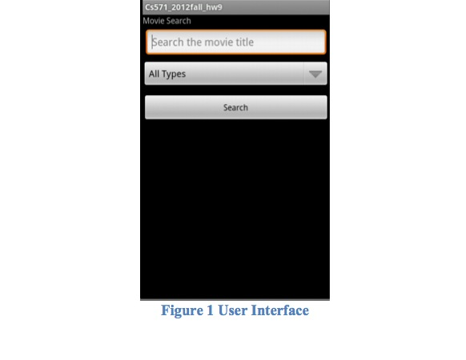
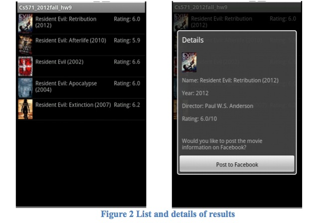
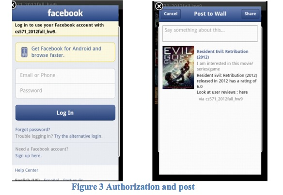
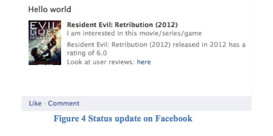
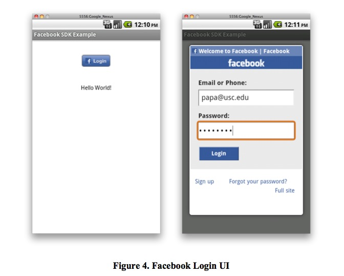
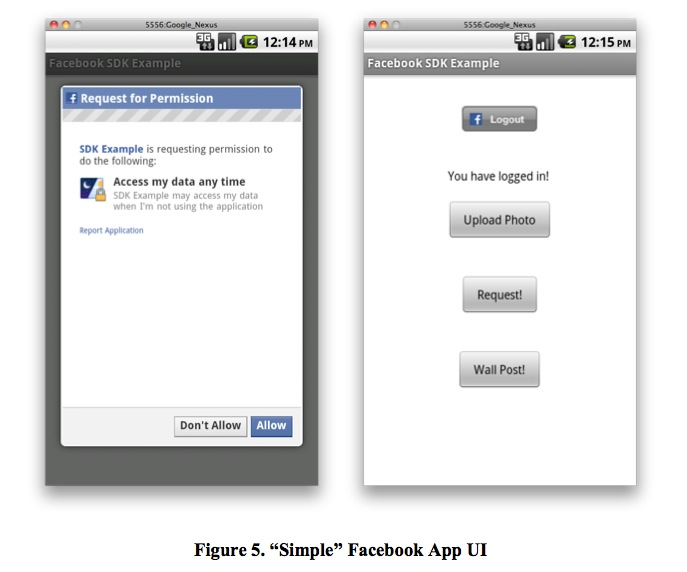

Web Technologies
================

### Homework: Android Facebook Post – A Mobile Phone Exercise

#### 1. Objectives

* Become familiar with the Eclipse, Android and Facebook;
* Use Java code with a combination of the Android SDK and Facebook APIs;
* Provide an interface to post text and pictures to Facebook.

#### 2. Background
##### 2.1 Eclipse
Eclipse is an open source community, whose projects are focused on building an open development platform comprised of extensible frameworks, tools and runtimes for building, deploying and managing software across the lifecycle.

The Eclipse Project was originally created by IBM in November 2001 and supported by a consortium of software vendors. The Eclipse Top-Level Project is an open source, robust, full-featured, commercial-quality, industry platform for the development of highly integrated tools and rich client applications.

The home page of the Eclipse Foundation is located at:

http://www.eclipse.org/

##### 2.2. Android
Android is a mobile operating system initially developed by Android Inc., a firm purchased by Google in 2005. Android is based upon a modified version of the Linux kernel. Unit sales for Android OS smartphones ranked first among all smartphone OS handsets sold in the U.S. in the second quarter of 2010, at 33%.

The Android operating system software stack consists of Java applications running on a Java based object oriented application framework on top of Java core libraries running on a Dalvik virtual machine featuring JIT compilation.

The Official Android home page is located at:

http://www.android.com/

The Official Android Developer home page is located at:

http://developer.android.com/index.html

##### 2.3 Facebook
Facebook is a global social networking website that is operated and privately owned by Facebook, Inc. Users can add friends and send them messages, and update their personal profiles to notify friends about themselves and what they are doing.

Users can additionally post news feeds to their profiles, and these feeds may include images, besides text messages.

The Facebook homepage is available at:

http://www.facebook.com

Facebook provides developers with an application-programming interface, called the Facebook Platform.

A beta version of the Facebook SDK for Android was demoed at Google I/O in San Francisco in May 2010.

#### 3. Prerequisites
This homework requires the use of the following components:

1. Download and install Eclipse. For windows users, first you need to install Java on your local machine. You can download JDK 7 from http://www.oracle.com/technetwork/java/javase/downloads/index.html. After installing the JDK, you need to add environment variable for JDK.
	* Properties -> Advanced -> Environment Variables -> System variables -> New Variable 
	Name:JAVA_HOME, Variable Value: Full path to the JDK
	* Typically, this full path looks something like C:\Program Files\Java\jdk1.7.0. Then modify the PATH variable as follows on Microsoft Windows: C:\WINDOWS\system32;C:\WINDOWS;C:\Program Files\Java\jdk1.7.0\bin
	* Note: The PATH environment variable is a series of directories separated by semicolons (;) and is not case-sensitive. Microsoft Windows looks for programs in the PATH directories in order, from left to right. You should only have one bin directory for a JDK in the path at a time. Those following the first instance are ignored. If you are not sure where to add the path, add it to the right of the value of the PATH variable. The new path takes effect in each new command window you open after setting the PATH variable.
	* Reboot your computer and type “java –version” in the terminal to see whether your JDK has been installed correctly.
For Mac and Linux users, you already have JDK installed with the OS.
After installing JDK, you can download Eclipse from http://www.eclipse.org/downloads/. Here I use latest version of Eclipse Indigo.

2. Download and install the Android SDK. Instructions on how to download and install both are available on the
http://developer.android.com/sdk/installing/index.html.

3. Download the Facebook Android SDK and register your application. You need to create a Facebook Platform application as documented at: https://developers.facebook.com/docs/mobile/android/build/#register. To do that you will need to create a Facebook Developer application: go to https://www.facebook.com/developers/createapp.php and click Allow it to access your information. Then click Set Up New Application. Name the application, agree to the terms, and click on Create Application. In the following windows keep all the defaults and click Save Changes. See the sections “Creating Your Facebook Application” and “Configuring Basic Settings”. In the window that displays next, you should see the Application ID (see figure below) that you will have to use with the Android Facebook SDK. For the Android key hash, you have to run the following command:

	-exportcert -alias androiddebugkey -keystore ~/.android/debug.keystore | openssl sha1 -binary | openssl base64
This works for Linux and Mac users. For Windows users, you should download openssl to do this. You can refer the blog http://sonyarouje.com/2011/09/18/facebook-hash-key-for-android-apps/.

#### 4. Description of the Exercise
In this exercise, you will write an Android Mobile application that does the following sequence of actions:
a) An edit box is provided to enter the search text and a spinner to select a movie genre (like the UI in HW #8).

Snapshot of the user interface is shown in Figure 1.

b) When a button named "Search" is clicked, the JSON data from HW #8 (from Tomcat) is retrieved. The data will be displayed in a list.

c) When each list item is clicked, a dialog will pop up and shows the details and a “Post to Facebook” button.

d) If user clicks the “Post to Facebook” button, the app will authorize (logs in) the user to Facebook; requests the user permission to access the user’s data; and then post the message to Facebook just like what you have done in HW #8.

e) The “Post to Facebook” button allows the user to post the brief introduction of the hotel to the Facebook Wall just like what you have done in HW #8.

To implement this exercise you are required to write a Java program using the Android SDK and the Facebook SDK for Android. The top-level interface consists of two areas:

* A control (widget) to select the movie to post (a combination of text and image); you can use any available Android control to perform this step (such as the ListView or Gallery widgets, for example) (Figure 2 uses a ListView widget);
* Another widget you may use is Dialog. It is used to display the detail of a hotel after clicking one list in the ListView.

#### 4.1 Facebook SDK for Android
To develop this exercise you will modify code provided by Facebook. The source code for the Facebook SDK for Android is available at:

http://github.com/facebook/facebook-android-sdk/

Click on “Downloads” and select the “Download .zip” button. The ZIP file will be downloaded to you PC or Mac. Extract the ZIP file on your Desktop. Name the folder facebook-android-sdk.

With a text editor, open the file named README.md inside the facebook-android-sdk. You will install the SDK and a sample program.

Use the instructions in the README.md file to install and configure the Facebook SDK, as described in the section titled “Getting Started”, which is duplicated here:

* Create a new project for the Facebook SDK in your Eclipse workspace.
* Open the File menu, select New --> Project and choose Android Project (inside the Android folder), then click Next.
* Select "Create project from existing source".
* Select the facebook subdirectory from within the git repository.
* You should see the project properties populated (you might want to change the project name to something like "FacebookSDK").
* Click Finish to complete the task.

The Facebook SDK is now configured and ready to go.

#### 4.2 Facebook Sample Application (App)
Navigate to the folder named examples/simple. Again follow the instructions in the README.md file to install the sample application stored in the aforementioned folder, using similar steps outlined above for the Facebook SDK.

Use the instructions in the README.md file to configure and run the Sample App, as described in the section titled “Run the Sample Application”, which is duplicated here:

* Add your Facebook application ID to the Example.java file (located inside Example/src/com.facebook.android). This Facebook app should use the New Data Permissions, as described in the known issues section in the README.md file. If you do not have a Facebook application ID, you can create one: http://www.facebook.com/developers/createapp.php (this process is covered in detail later in this assignment description) [note: you should have an Application ID from your HW #8]

* Build the project: from the Project menu, select "Build Project". You may see a build error about missing "gen" files, but this should go away when you build the project -- if you have trouble, try running "Clean..." in the Project menu.

* Run the application: from the Run menu, select "Run Configurations...". Under Android Application, you can create a new run configuration: give it a name and select the simple Example project; use the default activity Launch Action. See http://developer.android.com/guide/developing/eclipse-adt.html#RunConfig for more details.

If you did all the above correctly, you will now have a running Android application with a login UI as displayed in Figure 4 below.

Once you correctly login with a valid Facebook username / password, you will be displayed the Request for Permission dialog as shown in Figure 5 below. Click “Allow”.

Once you are properly logged in and have allowed the SDK Sample App to access your Facebook data, you will displayed the 4 buttons shown on the right of Figure 5.

If you reached this point with no errors, you have now the entire now code base that you will need for your project. You should try to invoke the “Upload Photo” and “Wall Post!” buttons, and see what they pop up and what they post on your Facebook account.

#### 5. Implementation Hints
* Facebook offers multiple APIs for you to upload or request data. In this implementation, you can use the Graph or REST APIs.
For the Graph API, please check the document here:
http://developers.facebook.com/docs/reference/api/
For the REST API, please check the document here:
http://developers.facebook.com/docs/reference/rest/

* If you still have problem on creating projects with Facebook API following the above instructions, you can create a new project and copy all the source code and resource file from Facebook API and sample projects to your new project. Make sure that you eliminate all the compiling errors and then start creating your own activities, so that you can use all the classes in the Facebook API freely.

* You are supposed to handle such situations like no hotels found and inform user whether the posting to the wall is successful or not.

* To better understand how Facebook Feeds work, you can read this page: http://wiki.developers.facebook.com/index.php/Feed